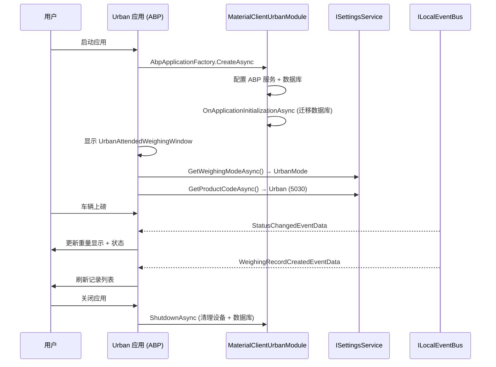

## Why

MaterialClient.Urban 是一个独立的桌面客户端，当前使用手动 `ServiceCollection` DI，缺乏 ABP 模块化架构。这导致与 MaterialClient 主应用的架构模式不一致，无法复用共享服务（ISettingsService、仓储、事件总线），并产生重复的实体模型和风格不一致的 UI。在 Urban 能够使用完整的共享服务层之前，必须集成 ABP 并对齐架构。

## What Changes

- **添加 Urban AbpModule**：创建 `MaterialClientUrbanModule`，依赖 `MaterialClientCommonModule`、`AbpAutofacModule`。用 `AbpApplicationFactory.CreateAsync<MaterialClientUrbanModule>()` 替换 `App.axaml.cs` 中的手动 `ServiceCollection`，与 MaterialClient 的启动模式对齐。
- **将 IUrbanWeighingService 合并到 ISettingsService**：当前 `IUrbanWeighingService` 仅暴露两个静态属性（`WeighingMode.UrbanMode`、`ProductCode.Urban`）。将 ProductCode 的查询/设置合并到 `ISettingsService`，然后完全移除 `IUrbanWeighingService`。
- **移除重复的实体模型**：Urban 的 `Models/WeighingRecord.cs` 和 `Models/DeviceStatus.cs` 以更简化的形式重复了 Common 实体。替换为 Common 实体（`MaterialClient.Common.Entities.WeighingRecord`），在需要时使用适当的映射。
- **重命名 WeighingSystemWindow → UrbanAttendedWeighingWindow**：重命名窗口、ViewModel、code-behind 及所有引用。与 MaterialClient 的 `AttendedWeighingWindow` 命名模式对齐。
- **对齐窗口布局与 MaterialClient 的 AttendedWeighingWindow**：重构四行布局（标题栏 / 重量区 / 内容+照片 / 状态栏），使其与 MaterialClient 的结构一致。用 MaterialClient 的共享样式类（`primary-button`、`titlebar-close-button`、`card-border` 等）替换内联的暗色主题样式。
- **修复 ViewModel 以使用 ReactiveUI Source Generators**：当前 `WeighingSystemViewModel` 已使用 `[AutoConstructor]` 和手动的 `RaiseAndSetIfChanged`，但 Models 仍使用 `INotifyPropertyChanged`。消除本地 Models，改用 Common 实体。

## Capabilities

### New Capabilities
- `urban-abp-module`：MaterialClient.Urban 的 ABP 模块定义 — 模块依赖、服务配置、数据库迁移和应用生命周期（启动/关闭），与 MaterialClient 的 MaterialClientModule 模式对齐。

### Modified Capabilities
- `system-configuration`：扩展 ISettingsService 以支持 Urban 模式的 ProductCode 查询和持久化，吸收已移除的 IUrbanWeighingService 的职责。
- `materialclient-urban-desktop`：将 WeighingSystemWindow 重命名为 UrbanAttendedWeighingWindow，对齐布局结构与 AttendedWeighingWindow，用共享的 MaterialClient 样式类替换内联样式，修复数据绑定以使用 Common 实体。

## Impact

| 区域 | 影响 |
|------|------|
| `MaterialClient.Urban/App.axaml.cs` | 重写：手动 ServiceCollection → ABP 应用工厂 |
| `MaterialClient.Urban/MaterialClient.Urban.csproj` | 添加 ABP NuGet 引用（Volo.Abp.Autofac 等） |
| 新增：`MaterialClient.Urban/MaterialClientUrbanModule.cs` | 新的 AbpModule 类 |
| `MaterialClient.Urban/Services/UrbanWeighingService.cs` | **删除** — 合并到 ISettingsService |
| `MaterialClient.Urban/Models/WeighingRecord.cs` | **删除** — 替换为 Common 实体 |
| `MaterialClient.Urban/Models/DeviceStatus.cs` | **删除** — 替换为 Common 类型或内联 |
| `MaterialClient.Urban/Views/WeighingSystemWindow.*` | 重命名为 `UrbanAttendedWeighingWindow.*`，布局重构 |
| `MaterialClient.Urban/ViewModels/WeighingSystemViewModel.cs` | 重命名，绑定更新为 Common 实体 |
| `MaterialClient.Common/Services/SettingsService.cs` | 扩展：ProductCode 查询/设置方法 |
| `MaterialClient.Urban/App.axaml` | 样式替换为共享的 MaterialClient 样式类 |
| `openspec/specs/system-configuration/` | ProductCode 接口的增量规范 |
| `openspec/specs/materialclient-urban-desktop/` | 窗口重命名、布局、样式变更的增量规范 |

## UI Prototype: UrbanAttendedWeighingWindow（目标布局）

```
┌──────────────────────────────────────────────────────────────────┐
│ [Logo] 凡东城管地磅系统                [最小化] [关闭]           │  ← Row 0: 标题栏 (#4169E1 蓝色)
├──────────────────────────────────────────────────────────────────┤
│                                              状态: 等待上磅     │  ← Row 1: 重量显示区 (#4A85F9 渐变)
│              12,345 吨                                         │
│                                                                │
├──────────────┬──────────────────────────────┬───────────────────┤
│ 记录列表      │  [重量区 / 主内容区]          │  照片区           │  ← Row 2: 内容区
│ (280px)      │  (*)                          │  (360px)         │
│              │                               │                  │
│ ┌──────────┐│                               │ ┌──────────────┐ │
│ │ Tab: 全部 ││                               │ │ 车牌识别抓拍  │ │
│ │ Tab: 正常 ││                               │ │              │ │
│ │ Tab: 异常 ││                               │ └──────────────┘ │
│ └──────────┘│                               │ ┌──────────────┐ │
│ [搜索栏]    │                               │ │ 摄像头抓拍    │ │
│ ┌──────────┐│                               │ │              │ │
│ │ 记录 1   ││                               │ └──────────────┘ │
│ │ 记录 2   ││                               │                  │
│ │ 记录 3   ││                               │                  │
│ └──────────┘│                               │                  │
│ 分页控件    │                               │                  │
├──────────────┴──────────────────────────────┴───────────────────┤
│ ● 地磅: 在线  ● 摄像头: 在线  ● 车牌识别: 离线                 │  ← Row 3: 状态栏 (#F5F5F5)
└──────────────────────────────────────────────────────────────────┘
```

## 用户交互流程



## 代码变更表

| 文件路径 | 变更类型 | 变更原因 | 影响范围 |
|-----------|---------|---------|---------|
| `MaterialClient.Urban/MaterialClientUrbanModule.cs` | **新增** | Urban 项目的 ABP 模块 | 核心架构 |
| `MaterialClient.Urban/App.axaml.cs` | 重写 | 替换手动 DI 为 ABP 工厂 | 启动生命周期 |
| `MaterialClient.Urban/MaterialClient.Urban.csproj` | 修改 | 添加 ABP Autofac 包 | 构建配置 |
| `MaterialClient.Urban/Services/UrbanWeighingService.cs` | **删除** | 合并到 ISettingsService | 服务层 |
| `MaterialClient.Urban/Models/WeighingRecord.cs` | **删除** | 使用 Common 实体 | 数据层 |
| `MaterialClient.Urban/Models/DeviceStatus.cs` | **删除** | 内联或使用 Common 类型 | 数据层 |
| `MaterialClient.Urban/Views/WeighingSystemWindow.axaml` | 重命名 + 重写 | → UrbanAttendedWeighingWindow，对齐布局 | UI |
| `MaterialClient.Urban/Views/WeighingSystemWindow.axaml.cs` | 重命名 + 重写 | → UrbanAttendedWeighingWindow.axaml.cs | UI code-behind |
| `MaterialClient.Urban/ViewModels/WeighingSystemViewModel.cs` | 重命名 + 修改 | → UrbanAttendedWeighingViewModel，使用 Common 实体 | ViewModel |
| `MaterialClient.Urban/App.axaml` | 修改 | 用共享样式类替换内联样式 | UI 样式 |
| `MaterialClient.Common/Services/SettingsService.cs` | 修改 | 添加 ProductCode 查询/设置方法 | 服务接口 |
