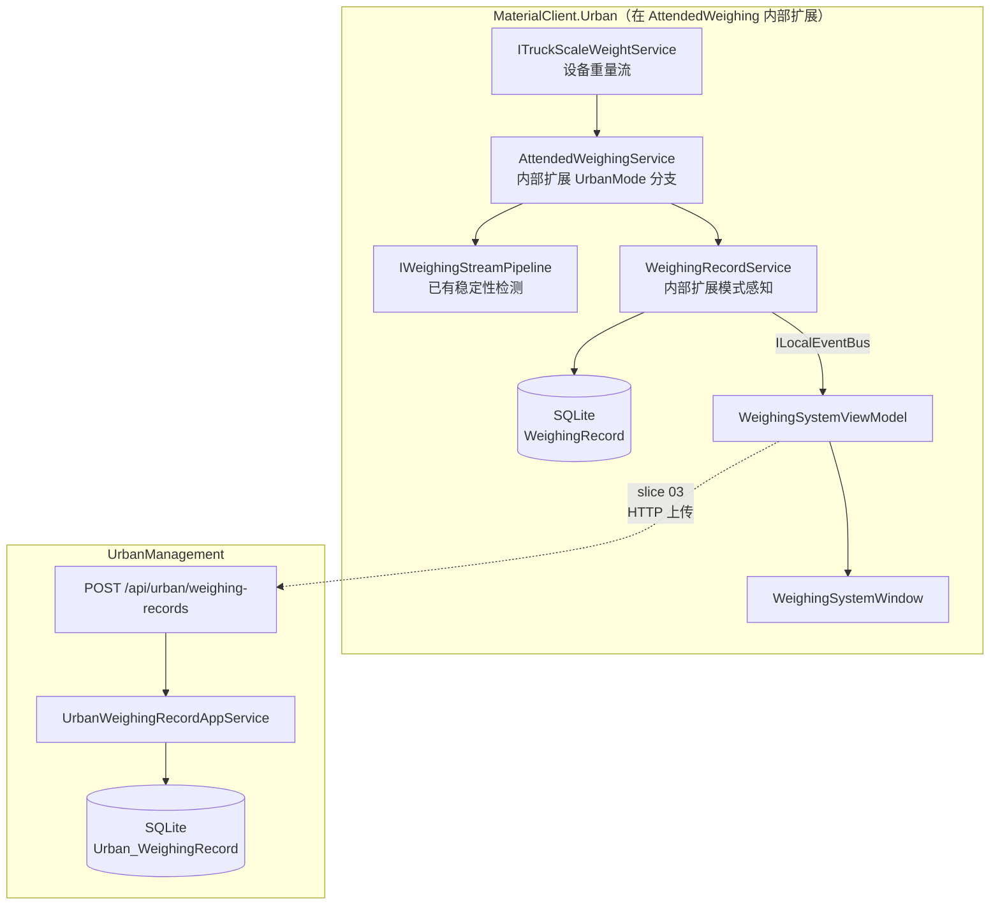
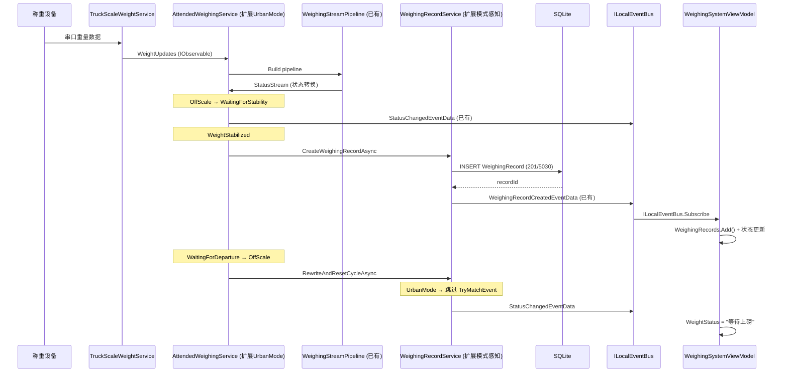

## Context

主界面已存在（slice 01 `materialclient-urban-desktop`），`WeighingSystemViewModel` 当前使用 mock 数据。称重设备层（`ITruckScaleWeightService`、`IWeighingStreamPipeline`）已在 MaterialClient 共享层实现。本切片将这两层连接起来：设备重量事件 → 稳定性检测 → 创建 WeighingRecord → 驱动 UI。

UrbanManagement 侧已有 ABP + EF Core SQLite 基础架构（`GovSyncData` 等实体），需新建接收称重记录的 API 端点和实体。

**约束**：
- MaterialClient.Urban 无 Generic Host、无 ABP 容器，服务注册在 `App.axaml.cs` 手动构造
- Urban 不做 waybill 匹对（ADR-5）
- `WeighingMode = UrbanMode (201)`、`ProductCode = 5030`
- 同步状态字段仅预留，上传逻辑由 slice 03 实现

## Goals / Non-Goals

**Goals**

- 重量稳定 → SQLite 一条 WeighingRecord（Mode=201, ProductCode=5030）→ 列表刷新
- 重量区实时显示（绑定 `CurrentWeight`，通过 `WhenAnyValue` 驱动）
- 状态文案联动（"等待上磅" / "正在称重" / "称重已结束"）
- 列表 Tab 筛选（全部/正常/异常）、称重时间与车牌查询、本地分页
- SyncStatus 字段（Pending/Synced/Failed）预留
- UrbanManagement 提供 `POST /api/urban/weighing-records` 接收端点及 `GET` 查询

**Non-Goals**

- Waybill 匹对
- HTTP 上传逻辑（slice 03）
- 设备遥测心跳（slice 04）
- 用户认证/授权

## Decisions

### D1：在 AttendedWeighingService 内部扩展 UrbanMode 支持

**决策**：不新建独立管线服务。直接在 `AttendedWeighingService` 内部加入 `WeighingMode` 感知，使 `ProcessStatusTransition` 和相关流程根据当前模式走不同分支。同样在 `WeighingRecordService` 内部扩展模式感知。

**理由**：`AttendedWeighingService` 已实现完整的称重管线（状态机、Rx 管线、异步队列、抓拍、音频、车牌重写）。Urban 与 Standard/SolidWaste 共享 99% 的管线逻辑，唯一区别是跳过 waybill 匹对。在服务内部通过模式分支处理差异，比新建独立服务更合理——改动集中、不重复代码、不破坏已有行为。

**具体扩展点**：
- `AttendedWeighingService.ProcessStatusTransition`：UrbanMode 分支跳过 `RewriteAndResetCycleAsync` 中的 `TryMatchEvent`
- `AttendedWeighingService.GetStatusAudioText`：UrbanMode 可使用不同音频文案（如有需要）
- `WeighingRecordService.TryReWritePlateNumberAsync`：UrbanMode 跳过 `TryMatchEvent` 发布

**备选方案**：新建 `UrbanWeighingService` 独立实现管线 → 拒绝，重复约 600 行管线逻辑，且需要维护两份几乎相同的代码。

### D2：复用 IWeighingStreamPipeline 做稳定性检测

**决策**：复用 MaterialClient 共享层的 `IWeighingStreamPipeline`（`WeighingStreamPipeline`），`AttendedWeighingService` 已在 `StartAsync` 中构建并订阅其组合状态流，无需额外操作。

**理由**：稳定性检测算法（Buffer + sliding window + range check）已完整实现且经过测试。Urban 与 Attended 模式使用相同的物理设备，稳定性标准一致。

### D3：ViewModel 通过 ILocalEventBus 接收称重管线事件

**决策**：`WeighingSystemViewModel` 通过 `ILocalEventBus` 订阅已有的 `WeighingRecordCreatedEventData` 和 `StatusChangedEventData`，不新建 MessageBus 消息类型。

**理由**：`WeighingRecordService` 已通过 `ILocalEventBus.PublishAsync(new WeighingRecordCreatedEventData(...))` 发布记录创建事件（见 `WeighingRecordService.cs:103`）。`WeighingStateManager` 已通过 `UpdateStatusAndNotify` 发布 `StatusChangedEventData`（见 `WeighingStateManager.cs:112-116`）。ViewModel 直接订阅这些已有事件即可，无需新建消息类型。

### D4：WeighingRecord 新增 SyncStatus 列

**决策**：在共享 `WeighingRecord` 实体上新增 `SyncStatus` 枚举字段（默认 `Pending`），不新建独立的同步队列表。

**理由**：SyncStatus 是记录本身的属性（Pending → Synced/Failed），与记录 1:1 关系。单表查询更简单，SQLite 列级筛选性能足够。

### D5：UrbanManagement 新建 UrbanWeighingRecord 实体

**决策**：在 UrbanManagement.Core 新建 `UrbanWeighingRecord` 实体（非复用 MaterialClient 的 WeighingRecord），映射到 `Urban_WeighingRecord` 表。

**理由**：两个系统有不同的持久化需求。MaterialClient 使用 ABP ORM + SQLite，UrbanManagement 使用 EF Core + SQLite。字段集合不同（UrbanManagement 不需要 MaterialsJson 等物料字段，但需要 SyncMetadata）。

### D6：UI 线程安全——ObserveOn(RxApp.MainThreadScheduler)

**决策**：所有从 Rx 管线到 ViewModel 的数据推送必须使用 `ObserveOn(RxApp.MainThreadScheduler)`。

**理由**：设备回调在后台线程，直接更新 `ObservableCollection` 会抛跨线程异常。AGENTS.md 明确要求此模式。

### D7：列表数据源——本地 SQLite 仓储

**决策**：列表数据从本地 SQLite 通过 `IRepository<WeighingRecord, long>` 查询，ViewModel 不直接持有设备数据。

**理由**：与 AttendedWeighing 模式一致，数据持久化后再查询 UI，保证数据一致性。

## Risks / Trade-offs

| 风险 | 缓解 |
|------|------|
| UI 线程与设备回调竞争 | `ObserveOn(RxApp.MainThreadScheduler)` 强制所有 UI 更新在主线程 |
| WeighingStreamPipeline 单例共享 | `Publish().RefCount()` 已在 pipeline 内部实现，多订阅者安全 |
| SyncStatus 列迁移（新增列） | SQLite `ALTER TABLE ADD COLUMN` 支持，无需数据迁移 |
| UrbanManagement 接收重复记录 | DTO 包含 ClientRecordId 做幂等键，服务端去重 |
| ViewModel 状态文案与实际称重状态不同步 | ViewModel 同时订阅状态流和记录事件，状态流为单一数据源 |

## Architecture

```
Component Hierarchy (MaterialClient.Urban — 在 AttendedWeighing 内部扩展)
├── App.axaml.cs (服务注册入口)
│   ├── IAttendedWeighingService → AttendedWeighingService (内部扩展 UrbanMode 分支)
│   │   ├── IWeighingStreamPipeline (已有稳定性检测)
│   │   ├── ITruckScaleWeightService (已有设备重量数据源)
│   │   ├── WeighingStateManager (已有状态机)
│   │   ├── WeighingRecordService (内部扩展模式感知)
│   │   │   └── TryReWritePlateNumberAsync: UrbanMode → 跳过 TryMatchEvent
│   │   ├── ProcessStatusTransition: UrbanMode → 模式特定分支
│   │   └── IWeighingCaptureService (已有抓拍服务)
│   └── WeighingSystemViewModel (UI 绑定)
│       ├── ILocalEventBus ← WeighingRecordCreatedEventData (已有)
│       ├── ILocalEventBus ← StatusChangedEventData (已有)
│       ├── CurrentWeight (绑定重量区)
│       ├── WeightStatus (绑定状态文案)
│       └── WeighingRecords (绑定列表 DataGrid)

Component Hierarchy (UrbanManagement)
├── UrbanWeighingRecordController (API 入口)
│   └── IUrbanWeighingRecordAppService (业务逻辑)
│       └── IRepository<UrbanWeighingRecord> (EF Core 持久化)
└── UrbanWeighingRecord (实体)
```





## Detailed Code Change Inventory

| 文件路径 | 变更类型 | 变更描述 | 影响模块 |
|----------|----------|----------|----------|
| `MaterialClient.Common/Services/AttendedWeighing/AttendedWeighingService.cs` | 修改 | `ProcessStatusTransition` 内部新增 UrbanMode 分支；注入 `ISettingsService` 查询当前模式 | 共享称重层 |
| `MaterialClient.Common/Services/AttendedWeighing/WeighingRecordService.cs` | 修改 | `TryReWritePlateNumberAsync` 内部模式感知：UrbanMode 跳过 `TryMatchEvent` 发布 | 共享称重层 |
| `MaterialClient.Urban/ViewModels/WeighingSystemViewModel.cs` | 修改 | 移除 mock 数据，通过 ILocalEventBus 订阅 WeighingRecordCreatedEventData 和 StatusChangedEventData | Urban UI |
| `MaterialClient.Urban/App.axaml.cs` | 修改 | 解析并启动 IAttendedWeighingService.StartAsync() | Urban 启动 |
| `MaterialClient.Common/Entities/WeighingRecord.cs` | 修改 | 新增 SyncStatus 属性 | 共享域层 |
| `MaterialClient.Common/Entities/Enums/SyncStatus.cs` | 新建 | 同步状态枚举 | 共享域层 |
| `UrbanManagement.Core/Entities/UrbanWeighingRecord.cs` | 新建 | 服务端称重记录实体 | 服务端域层 |
| `UrbanManagement.Core/EntityFrameworkCore/UrbanManagementDbContext.cs` | 修改 | 添加 UrbanWeighingRecord DbSet | 服务端数据层 |
| `UrbanManagement.Core/Services/UrbanWeighingRecordAppService.cs` | 新建 | 称重记录业务逻辑（接收、去重、查询） | 服务端应用层 |
| `UrbanManagement.App/Controllers/UrbanWeighingRecordController.cs` | 新建 | API 控制器（POST 接收、GET 查询） | 服务端 API 层 |
