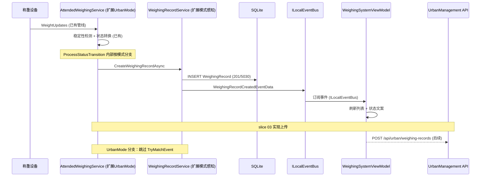

## Why

Urban 桌面端主界面已存在（slice 01），但称重设备事件尚未接入。重量稳定后无法自动创建 WeighingRecord、无法刷新列表、无法驱动主界面状态文案。需要建立从设备重量事件到 UI 的完整称重记录管线，并将同步状态字段（Pending/Synced/Failed）预留供 slice 03 上传使用。

## What Changes

- **扩展 `AttendedWeighingService` 支持 UrbanMode**：在现有 `AttendedWeighingService` 内部加入 `WeighingMode` 感知，使其在 `ProcessStatusTransition` 和记录创建流程中根据模式走不同分支（UrbanMode 跳过 waybill 匹对、调整音频文案等）。不新建独立管线服务。
- **扩展 `WeighingRecordService` 模式感知**：在 `TryReWritePlateNumberAsync` 和 `CreateWeighingRecordAsync` 内部，当 `WeighingMode = UrbanMode` 时跳过 `TryMatchEvent` 发布。
- **WeighingSystemViewModel 绑定**：通过 `ILocalEventBus` 订阅已有的 `WeighingRecordCreatedEventData` 和 `StatusChangedEventData`，刷新 `ObservableCollection<WeighingRecord>`、绑定 `CurrentWeight` 实时显示、状态文案联动。
- **列表筛选与分页**：Tab 筛选（全部/正常/异常）、称重时间与车牌查询、数据来自本地 SQLite。
- **同步状态字段**：WeighingRecord 新增 `SyncStatus`（Pending/Synced/Failed），供 slice 03 上传管线消费。
- **UrbanManagement API 接收端**：新建 `UrbanWeighingRecord` 实体和 `POST /api/urban/weighing-records` 接口，接收 MaterialClient 推送的称重记录。

```
┌─ MaterialClient.Urban 主界面 ──────────────────────────────┐
│ ┌─ 标题栏 (48px) ────────────────────────────────────────┐ │
│ │ Logo  凡东城管地磅系统                    [设置] [×]    │ │
│ └────────────────────────────────────────────────────────┘ │
│ ┌─ 重量区 (72px) ────────────────────────────────────────┐ │
│ │  [ 12,500 kg ]    称重已结束 ●                         │ │
│ └────────────────────────────────────────────────────────┘ │
│ ┌─ 记录列表 + 照片侧栏 ─────┬─ 照片区 ─────────────────┐ │
│ │ [全部] [正常] [异常]       │ 车牌识别抓拍             │ │
│ │ ┌─────┬──────┬────┬────┐  │ ┌────────────────────┐   │ │
│ │ │车牌 │时间  │重量│状态│  │ │   [车牌照片]       │   │ │
│ │ ├─────┼──────┼────┼────┤  │ └────────────────────┘   │ │
│ │ │京A..│10:30 │12t │待传│  │ 摄像头抓拍               │ │
│ │ │京B..│10:15 │ 8t │已传│  │ ┌────────────────────┐   │ │
│ │ └─────┴──────┴────┴────┘  │ │   [现场照片]       │   │ │
│ │ [< 1 2 3 >]               │ └────────────────────┘   │ │
│ └────────────────────────────┴──────────────────────────┘ │
│ ┌─ 设备状态栏 (36px) ────────────────────────────────────┐ │
│ │ ● 地磅在线  ● 摄像头1在线  ● 车牌识别在线             │ │
│ └────────────────────────────────────────────────────────┘ │
└────────────────────────────────────────────────────────────┘
```



## Capabilities

### New Capabilities
- `urban-weighing-record-pipeline`: MaterialClient 侧——扩展 `AttendedWeighingService` 和 `WeighingRecordService` 内部支持 UrbanMode（模式感知分支），ViewModel 通过 `ILocalEventBus` 订阅已有事件驱动列表/重量/状态 UI。
- `urban-weighing-record-reception`: UrbanManagement 侧称重记录接收——API 端点、实体持久化、记录查询。

### Modified Capabilities
- `attended-weighing`: 在 `AttendedWeighingService` 内部扩展 UrbanMode 分支——`ProcessStatusTransition` 和 `WeighingRecordService` 根据模式走不同逻辑（跳过 TryMatchEvent、模式特定行为）。
- `weighing-device-capture`: UrbanMode 下设备事件接入方式确认（复用现有 `ITruckScaleWeightService`，无需新增接口）。
- `materialclient-urban-desktop`: ViewModel 从 mock 数据切换为真实称重管线驱动的数据绑定。

## Impact

| 仓库 | 影响范围 |
|------|----------|
| **MaterialClient** | 扩展 `AttendedWeighingService` 内部支持 UrbanMode（`ProcessStatusTransition` 模式分支）；扩展 `WeighingRecordService` 模式感知（跳过 TryMatchEvent）；修改 `WeighingSystemViewModel` 订阅 `ILocalEventBus` 事件绑定真实数据；修改 `App.axaml.cs` 启动 `IAttendedWeighingService`；WeighingRecord 新增 SyncStatus 字段 |
| **UrbanManagement** | 新建 `UrbanWeighingRecord` 实体、DbContext 配置、API Controller；新建 `POST /api/urban/weighing-records` 端点 |
| **依赖** | 直接复用 `IAttendedWeighingService`、`WeighingRecordService`、`WeighingStateManager`、`IWeighingStreamPipeline`、`ITruckScaleWeightService`、`ILocalEventBus` |
| **数据库** | MaterialClient SQLite：WeighingRecord 表新增 SyncStatus 列；UrbanManagement SQLite：新建 UrbanWeighingRecord 表 |

| 文件路径 | 变更类型 | 变更原因 | 影响范围 |
|----------|----------|----------|----------|
| `MaterialClient.Common/Services/AttendedWeighing/AttendedWeighingService.cs` | 修改 | `ProcessStatusTransition` 新增 UrbanMode 分支 | 共享称重层 |
| `MaterialClient.Common/Services/AttendedWeighing/WeighingRecordService.cs` | 修改 | `TryReWritePlateNumberAsync` 模式感知（UrbanMode 跳过 TryMatchEvent） | 共享称重层 |
| `MaterialClient.Urban/ViewModels/WeighingSystemViewModel.cs` | 修改 | 从 mock 切换为 ILocalEventBus 事件绑定 | Urban 主界面 |
| `MaterialClient.Urban/App.axaml.cs` | 修改 | 启动 IAttendedWeighingService | Urban 启动 |
| `MaterialClient.Common/Entities/WeighingRecord.cs` | 修改 | 新增 SyncStatus 字段 | 共享层 |
| `UrbanManagement.Core/Entities/UrbanWeighingRecord.cs` | 新建 | 服务端称重记录实体 | 服务端 |
| `UrbanManagement.App/Controllers/UrbanWeighingRecordController.cs` | 新建 | 称重记录接收 API | 服务端 |
