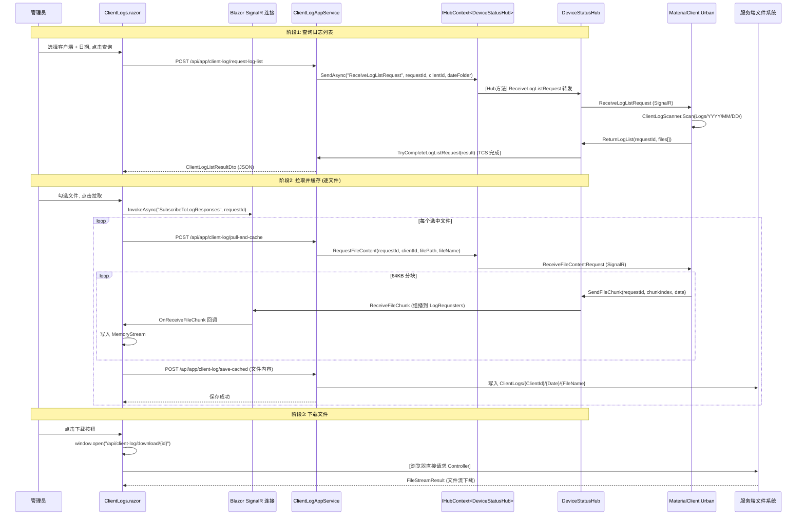
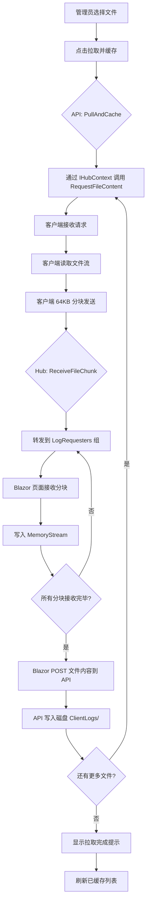

## Context

UrbanManagement 是一个 ABP Blazor Server 应用（.NET 10.0），用于城管建筑工地数据管理。后端日志拉取基础设施已经搭建完成：`DeviceStatusHub` 支持 SignalR 日志拉取、文件分块传输；`ClientLogAppService` 提供日志列表请求、缓存管理、下载等 API 接口；DTO 和模型定义齐全。但 **前端 UI 完全缺失**（无 `ClientLogs.razor` 页面、无导航入口），且后端有 3 个方法抛出 `NotImplementedException`（`DownloadBatchCachedAsync`、`DeleteCachedAsync`、`DeleteBatchCachedAsync`），`PullAndCacheAsync` 的 SignalR 文件接收逻辑为占位实现，`GetOnlineClientsAsync` 返回空列表。

MaterialClient.Urban（Avalonia 桌面端）作为参考仓库，已实现完整的客户端侧日志拉取服务（`ClientLogPullService`），通过 SignalR 响应服务端的日志列表扫描和文件分块传输请求。

**技术栈**：Blazor Server + LayUI CDN + Bootstrap 5 + SignalR + SQLite (EF Core) + ABP 10 框架。文件缓存到 `{ContentRoot}/ClientLogs/` 磁盘目录。

## Goals / Non-Goals

**Goals:**

- 创建完整的 Blazor UI 页面 `ClientLogs.razor`，覆盖在线客户端选择、日志文件查询、拉取缓存、下载、删除全流程
- 补全 `ClientLogAppService` 中 3 个 `NotImplementedException` 方法的业务逻辑
- 完善 `PullAndCacheAsync` 接入 SignalR 文件分块传输通道
- 接入 `GetOnlineClientsAsync` 到 DeviceStatusHub 的 `_logCapabilityRegistry` 数据源
- 新增 `ClientLogController` 处理文件流下载（绕过 ABP Auto API 的 JSON 序列化）
- 在 `AdminLayout.razor` 侧边栏添加"客户端日志"导航入口

**Non-Goals:**

- 不修改 MaterialClient 客户端代码（仅参考）
- 不实现数据库 Schema 变更（`ClientLog` 实体已定义但未使用，本次继续使用文件系统缓存方案）
- 不实现权限控制系统（`UrbanManagementPermissions.ClientLogs` 定义留待后续，本次不启用 ABP 权限拦截）
- 不实现日志文件在线预览/查看内容功能（仅下载到本地后查看）
- 不实现响应式移动端适配（保持与现有页面一致的桌面端优先策略）

## Decisions

### D1: 文件缓存方案 — 纯文件系统（无数据库）

**选择**：继续使用纯文件系统缓存（`ClientLogs/{ClientId}/{Date}/`），不引入数据库实体。

**理由**：
- 现有 `GetCachedLogsAsync` 已基于文件系统扫描实现
- 日志文件本身是临时缓存，无需持久化索引
- 避免数据库 Schema 变更和 EF Core 迁移
- 删除操作只需物理删除 + 内存字典更新

**替代方案**：使用 `ClientLog` 数据库实体做索引。拒绝原因：引入不必要的迁移复杂度，且当前规模（少量客户端 × 30天保留）不需要数据库查询。

### D2: 文件标识方案 — 路径哈希作为 Guid

**选择**：使用 `CachedLogFileDto` 的路径哈希作为临时 Guid，用于单文件下载定位。

**理由**：
- 现有 `DownloadCachedAsync(Guid id)` 使用 `id.GetHashCode() % allFiles.Length` 定位，脆弱且不安全
- 改用路径的确定性 SHA256 哈希截取前 16 字节作为 Guid，确保同一文件路径始终映射到同一 ID
- 缓存日志列表加载时构建 `Dictionary<Guid, string>` 映射

**替代方案**：重构接口改为 `DownloadCachedAsync(string clientId, string dateFolder, string fileName)` 直接参数定位。拒绝原因：改动接口签名影响 ABP Auto API 路由，且需要前端传递多个参数。

### D3: SignalR 文件传输 — 复用 Hub 的 LogRequesters 组

**选择**：`PullAndCacheAsync` 在 Blazor Server 中直接使用注入的 `IHubContext<DeviceStatusHub>` 发起文件传输请求，通过 `LogRequesters` SignalR 组接收分块回调。

**理由**：
- `DeviceStatusHub.ReceiveFileChunk` 已实现分块转发到 `LogRequesters` 组
- Blazor Server 页面可订阅同一 Hub 的 `LogRequesters` 组监听分块到达
- 保持与现有 `RequestLogListAsync` 一致的 SignalR ↔ HTTP 桥接模式

**实现要点**：
- Blazor 页面 SignalR 连接加入 `LogRequesters` 组
- `PullAndCacheAsync` 通过 `IHubContext` 调用 `RequestFileContent` 向客户端发请求
- Blazor 页面的 `OnReceiveFileChunk` 回调将分块写入内存 `MemoryStream`
- 所有分块接收完毕后，通过 API 调用将文件内容 POST 到后端保存

**替代方案**：`PullAndCacheAsync` 内部直接使用 `ConcurrentDictionary<string, MemoryStream>` 收集分块。拒绝原因：AppService 是 transient/singleton 生命周期，与 Hub 静态字典状态管理耦合复杂。

### D4: 下载 Controller — 独立 Controller 替代 ABP Auto API

**选择**：新增 `ClientLogController`（继承 `ControllerBase`），处理文件流下载。

**理由**：
- ABP Auto API 的 `IApplicationService` 方法默认返回 JSON，不支持 `FileStreamResult`
- 单文件下载和批量 ZIP 下载都需要返回二进制文件流
- 独立 Controller 可精确控制 `Content-Type`、`Content-Disposition`、`Response.Headers`

**路由设计**：
- `GET /api/client-log/download/{id}` → 单文件下载
- `POST /api/client-log/download-batch` → 批量 ZIP 下载（body: `{ logIds: [...] }`）

### D5: 批量下载 ZIP 大小限制 — 500MB

**选择**：`DownloadBatchCachedAsync` 在打包前校验总大小，超过 500MB 直接拒绝。

**理由**：
- ZIP 打包在内存中进行，大文件可能 OOM
- Blazor Server 的同步 HTTP 响应有超时限制
- 500MB 足够覆盖日常调试场景

### D6: UI 组件模式 — 复用现有 LayUI 组件样式

**选择**：`ClientLogs.razor` 复用 `components.css` 中的现有组件样式（`data-table`、`pagination`、`badge`、`modal`、`loading-state`、`search-input`、`empty-state`），不引入新 UI 框架。

**理由**：
- 现有页面（ProjectManagement、WeighingRecord）已建立一致的组件模式
- 日志页面结构与称重记录页面高度相似（筛选条件 + 数据表格 + 分页）
- LayUI CDN 已加载，layui-btn 类名可直接使用

## Architecture

```
UrbanManagement Blazor Server — 日志管理模块架构

┌─────────────────────────────────────────────────────────────────┐
│  Blazor Frontend (ClientLogs.razor)                             │
│                                                                 │
│  ┌──────────────┐  ┌───────────────┐  ┌──────────────────┐    │
│  │ 查询条件面板  │  │ 日志文件表格    │  │ 已缓存日志表格    │    │
│  │ - 客户端选择  │  │ - 复选框选择    │  │ - 分页列表       │    │
│  │ - 日期选择器  │  │ - 文件大小      │  │ - 单文件下载     │    │
│  │ - 查询按钮    │  │ - 修改时间      │  │ - 删除按钮       │    │
│  └──────────────┘  │ - 拉取按钮      │  │ - 批量下载ZIP    │    │
│                     └───────────────┘  │ - 批量删除       │    │
│                                        └──────────────────┘    │
│  ┌──────────────────────────────────────────────────────────┐   │
│  │ SignalR HubConnection (Blazor ↔ Server)                  │   │
│  │ - LogListResponse 回调                                    │   │
│  │ - ReceiveFileChunk 回调 → MemoryStream → POST 保存       │   │
│  └──────────────────────────────────────────────────────────┘   │
└───────────────────────────┬─────────────────────────────────────┘
                            │ HTTP API / SignalR
┌───────────────────────────▼─────────────────────────────────────┐
│  ASP.NET Core Backend                                          │
│                                                                 │
│  ┌─────────────────────┐  ┌─────────────────────────────────┐  │
│  │ ClientLogController  │  │ ClientLogAppService             │  │
│  │ (新增)               │  │ (完善现有)                       │  │
│  │ - GET download/{id}  │  │ - GetOnlineClients ★ 补全       │  │
│  │ - POST download-batch│  │ - RequestLogList ✓ 已完成      │  │
│  │   → ZIP FileStream   │  │ - PullAndCache ★ 补全           │  │
│  └─────────┬───────────┘  │ - GetCachedLogs ✓ 已完成        │  │
│            │              │ - DownloadCached ★ 补全         │  │
│            │              │ - DownloadBatch ★ 实现 ZIP      │  │
│            │              │ - DeleteCached ★ 实现           │  │
│            │              │ - DeleteBatch ★ 实现             │  │
│            │              └──────────┬──────────────────────────┘  │
│            │                         │ IHubContext              │
│  ┌─────────▼─────────────────────────▼──────────────────────────┐│
│  │ DeviceStatusHub (SignalR)                                   ││
│  │ - RegisterLogCapability ✓                                    ││
│  │ - RequestLogList / ReturnLogList ✓                           ││
│  │ - RequestFileContent / ReceiveFileChunk ✓                   ││
│  │ - _logCapabilityRegistry (内存字典) → GetOnlineClients 数据源 ││
│  └────────────────────────┬────────────────────────────────────┘│
│                           │ SignalR                            │
└───────────────────────────┼────────────────────────────────────┘
                            │
┌───────────────────────────▼────────────────────────────────────┐
│  MaterialClient.Urban (Avalonia Desktop)                        │
│                                                                 │
│  ClientLogPullService                                           │
│  - ReceiveLogListRequest → ClientLogScanner.Scan()              │
│  - ReceiveFileContentRequest → 64KB chunk streaming             │
└─────────────────────────────────────────────────────────────────┘
```

## API Sequence: 完整拉取流程



## Data Flow: 文件拉取缓存



## Detailed Code Change Map

| # | 文件路径 | 变更类型 | 变更说明 | 影响模块 |
|---|---------|---------|---------|---------|
| 1 | `src/UrbanManagement.App/Pages/ClientLogs.razor` | **新增** | 日志管理 Blazor 页面（~500 行），包含查询面板、日志文件表格、已缓存日志表格、拉取进度弹窗、确认删除弹窗 | UI 层 |
| 2 | `src/UrbanManagement.App/Pages/AdminLayout.razor` | 修改 | `_navItems` 列表添加 `new("/client-logs", "客户端日志")` | 导航 |
| 3 | `src/UrbanManagement.App/Controllers/ClientLogController.cs` | **新增** | 文件流下载 Controller（~80 行），处理单文件下载和批量 ZIP 下载 | API 层 |
| 4 | `src/UrbanManagement.Core/Services/ClientLogAppService.cs` | 修改 | (a) `GetOnlineClientsAsync` 从 Hub 静态字典读取数据 (b) `PullAndCacheAsync` 实现保存逻辑 (c) `DownloadCachedAsync` 通过路径映射定位文件 (d) `DownloadBatchCachedAsync` 实现 ZIP 打包 (e) `DeleteCachedAsync` / `DeleteBatchCachedAsync` 实现物理删除 | 服务层 |
| 5 | `src/UrbanManagement.Core/Services/IClientLogAppService.cs` | 修改 | 新增 `SaveCachedFileAsync` 方法签名（接收文件流并保存） | 接口 |
| 6 | `src/UrbanManagement.Core/Models/ClientLogInputDtos.cs` | 修改 | 新增 `SaveCachedFileDto`（ClientId、FilePath、FileName、FileContent base64） | DTO |
| 7 | `src/UrbanManagement.Core/Models/ClientLogListResultDto.cs` | 修改 | 新增 `LogCapabilityInfo` 的 `ClientName` 属性（用于显示友好名称） | DTO |
| 8 | `src/UrbanManagement.Core/Hubs/DeviceStatusHub.cs` | 修改 | 新增 `GetAllLogCapabilities()` 公共静态方法，暴露 `_logCapabilityRegistry` 读取接口 | SignalR |
| 9 | `src/UrbanManagement.App/wwwroot/css/components.css` | 修改 | 新增日志页面专用样式（进度条、双栏筛选面板、操作工具栏） | 样式 |

## Key Implementation Details

### PullAndCacheAsync 完善方案

当前 `PullAndCacheAsync` 是占位实现。完善策略：

1. **不在此方法内处理 SignalR 分块接收**（AppService 生命周期不适合持有 Hub 连接状态）
2. 新增 `SaveCachedFileAsync(SaveCachedFileDto dto)` 方法：接收客户端传来的完整文件内容（base64），写入 `ClientLogs/{ClientId}/{Date}/{FileName}`
3. Blazor 页面负责 SignalR 分块收集 → 组装完整内容 → 调用 `SaveCachedFileAsync` 保存

```
Blazor 页面          AppService           文件系统
    │                    │                   │
    │─ RequestFileContent ──▶│               │
    │                    │── SignalR ──▶ Client
    │◀─ ReceiveFileChunk ───│               │
    │  (累积到 MemoryStream)  │               │
    │                    │                   │
    │─ SaveCachedFile ──▶│                   │
    │                    │── Write ──▶ disk   │
    │◀─ OK ─────────────│                   │
```

### GetOnlineClientsAsync 补全方案

`DeviceStatusHub._logCapabilityRegistry` 是 `private static`。新增公共静态方法：

```csharp
// DeviceStatusHub.cs
public static List<ClientInfoDto> GetAllLogCapabilities()
{
    lock (_logCapabilityRegistryLock)
    {
        return _logCapabilityRegistry.Select(kvp => new ClientInfoDto
        {
            ClientId = kvp.Key,
            ClientName = kvp.Key, // 客户端目前不发送名称
            LastConnectedAt = kvp.Value.RegisteredAt,
            SupportsLogPull = kvp.Value.Capability.SupportsLogPull
        }).ToList();
    }
}
```

`ClientLogAppService.GetOnlineClientsAsync` 直接调用此静态方法。

### DownloadCachedAsync 路径映射方案

缓存文件列表加载时构建映射：

```csharp
private readonly ConcurrentDictionary<Guid, string> _pathMap = new();

// 在 GetCachedLogsAsync 中填充：
var id = Guid.NewGuid();
_pathMap[id] = filePath;
dto.Id = id;

// 在 DownloadCachedAsync 中查找：
if (_pathMap.TryGetValue(id, out var path) && File.Exists(path))
{
    return new FileDownloadResultDto { FilePath = path, ... };
}
```

## Risks / Trade-offs

**[R1] SignalR 大文件传输可能超时或断连**
→ 缓解：64KB 分块 + 每 10 块 10ms 间隔（客户端已实现）；拉取进度弹窗显示实时状态；失败时显示错误并提供重试

**[R2] ConcurrentDictionary 路径映射在 AppService 生命周期外丢失**
→ 缓解：`ClientLogAppService` 注册为 Singleton（当前为 ABP 默认的 Transient），需改为 Singleton 或使用静态字典。选择静态 `ConcurrentDictionary`，与 Hub 的静态字典模式一致

**[R3] 批量 ZIP 打包消耗内存**
→ 缓解：500MB 大小限制；使用 `ZipArchive` 流式写入 `MemoryStream`，不额外缓冲；超出限制直接拒绝

**[R4] 文件系统缓存无清理机制**
→ 缓解：本次不实现自动清理（Non-Goal），管理员通过 UI 手动删除；后续可添加定时清理任务

## Open Questions

1. ~~是否需要 `ClientLog` 数据库实体？~~ — 已决定：不使用，继续文件系统方案
2. MaterialClient.Urban 客户端是否发送 `ClientName`？ — 当前仅发送 `ClientId`，显示时使用 `ClientId` 作为名称
3. 是否需要在拉取日志前检查磁盘可用空间？ — 可选增强，本次不实现
