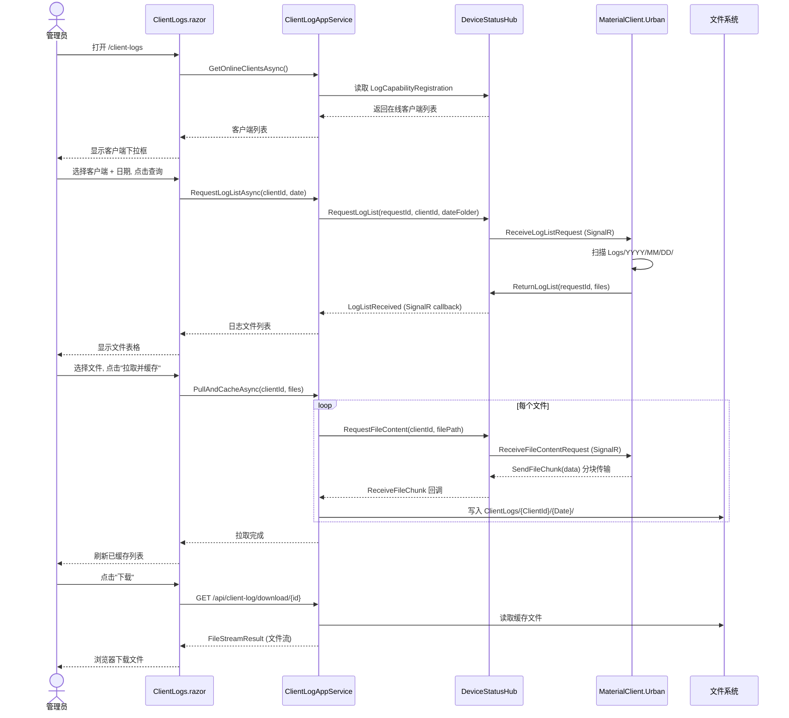

## Why

UrbanManagement 的后端日志服务（SignalR Hub、AppService、DTO）已完整实现，但 **完全缺少前端 UI 页面**，导致管理员无法通过浏览器查看、拉取和下载 MaterialClient.Urban 客户端日志。此外，`ClientLogAppService` 中有 3 个方法（批量下载 ZIP、删除缓存、批量删除）仍抛出 `NotImplementedException`，`PullAndCacheAsync` 的文件传输逻辑为占位实现，`GetOnlineClientsAsync` 未接入 DeviceStatusHub 实际数据。本变更将补全 UI 层并完善后端缺失方法，形成完整的客户端日志管理闭环。

## What Changes

- **新增 `ClientLogs.razor` Blazor 页面**：提供在线客户端选择、日期浏览、日志文件列表展示、拉取缓存、单文件/批量下载、删除等完整 UI 交互
- **新增导航入口**：在 `AdminLayout.razor` 侧边栏菜单中添加"客户端日志"菜单项（路由 `/client-logs`），图标为文件夹
- **实现 `DownloadBatchCachedAsync`**：将多个已缓存日志打包为 ZIP 流返回（`System.IO.Compression.ZipArchive`），校验总大小不超过 `MaxZipSizeMB`
- **实现 `DeleteCachedAsync` / `DeleteBatchCachedAsync`**：删除物理文件 + 标记数据库记录软删除（`IsDeleted = true`），写入审计日志
- **完善 `PullAndCacheAsync`**：接入 DeviceStatusHub 的 `RequestFileContent` + `ReceiveFileChunk` 通道，将客户端文件分块传输后写入 `ClientLogs/{ClientId}/{Date}/` 目录
- **完善 `GetOnlineClientsAsync`**：从 `DeviceStatusHub` 的 `LogCapabilityRegistration` 字典读取已注册日志拉取能力的在线客户端列表
- **新增下载专用 Controller**：`ClientLogController` 处理单文件和批量 ZIP 的文件流响应（`FileStreamResult`），绕过 ABP Auto API 的 JSON 序列化

## Capabilities

### New Capabilities

- `client-log-view-page`: UrbanManagement Blazor 客户端日志查看页面，包含在线客户端选择、日期浏览、文件列表、拉取缓存、下载、删除等完整交互流程

### Modified Capabilities

- `server-log-pull-api`: 完善 `DownloadBatchCachedAsync`、`DeleteCachedAsync`、`DeleteBatchCachedAsync` 三个未实现方法的业务逻辑；补全 `PullAndCacheAsync` 的 SignalR 文件传输；接入 `GetOnlineClientsAsync` 实际数据源
- `client-log-management-ui`: 无需修改（现有 spec 已完整定义 UI 需求），本次为实现对应 spec 的首次落地

## Impact

### 受影响文件

| 文件 | 变更类型 | 说明 |
|------|----------|------|
| `src/UrbanManagement.App/Pages/ClientLogs.razor` | **新增** | 日志管理 Blazor 页面 |
| `src/UrbanManagement.App/Pages/AdminLayout.razor` | 修改 | 添加"客户端日志"导航项 |
| `src/UrbanManagement.App/Controllers/ClientLogController.cs` | **新增** | 文件流下载 Controller |
| `src/UrbanManagement.Core/Services/ClientLogAppService.cs` | 修改 | 实现缺失方法 + 完善文件传输 |
| `src/UrbanManagement.Core/Services/IClientLogAppService.cs` | 修改 | 接口签名微调（批量删除等） |
| `src/UrbanManagement.Core/Models/ClientLogInputDtos.cs` | 修改 | 新增批量操作 DTO |
| `src/UrbanManagement.App/wwwroot/css/components.css` | 修改 | 新增日志页面组件样式 |

### 依赖和 API

- 依赖 `DeviceStatusHub` 的 `LogCapabilityRegistration` 内存字典作为在线客户端数据源
- 依赖 `System.IO.Compression` 用于 ZIP 打包
- 不涉及数据库 Schema 变更（`ClientLog` 实体已定义）
- 不影响现有称重记录、项目管理等功能

### 交互流程



### UI 原型（桌面端）

```
┌─────────────────────────────────────────────────────────────────────┐
│  仪表盘  项目管理  称重记录  异常审批  [客户端日志]                    │
├─────────────────────────────────────────────────────────────────────┤
│                                                                     │
│  客户端日志管理                                    [🔄 刷新]         │
│                                                                     │
│  ┌─ 查询条件 ─────────────────────────────────────────────────────┐ │
│  │  客户端: [▼ 测试站点A (material-client-001)]                   │ │
│  │  日  期: [📅 2025-06-22              ]  [🔍 查询日志]         │ │
│  └───────────────────────────────────────────────────────────────┘ │
│                                                                     │
│  ┌─ 客户端日志文件 ──────────────────────────────────────────────┐ │
│  │  ☐ 文件名                       大小     修改时间    操作     │ │
│  │  ☑ MaterialClient.Urban-20250622.log   5.0 MB  06-22 23:59  │ │
│  │  ☑ MaterialClient.Urban-20250622_001.log 3.2 MB  06-22 18:30  │ │
│  │  ☐ MaterialClient.Urban-20250622_002.log 1.1 MB  06-22 12:15  │ │
│  │                                                                 │ │
│  │  已选 2 项    [📥 拉取并缓存]                                   │ │
│  └─────────────────────────────────────────────────────────────────┘ │
│                                                                     │
│  ┌─ 已缓存日志 ──────────────────────────────────────────────────┐ │
│  │  客户端          日期       文件名                   操作      │ │
│  │  material-client-001  06-22  Urban-20250622.log     [⬇] [🗑]  │ │
│  │  material-client-002  06-21  Urban-20250621.log     [⬇] [🗑]  │ │
│  │                                                                 │ │
│  │  共 2 条记录  [📥 批量下载ZIP]  [🗑 批量删除]                   │ │
│  └─────────────────────────────────────────────────────────────────┘ │
│                                                                     │
└─────────────────────────────────────────────────────────────────────┘
```
