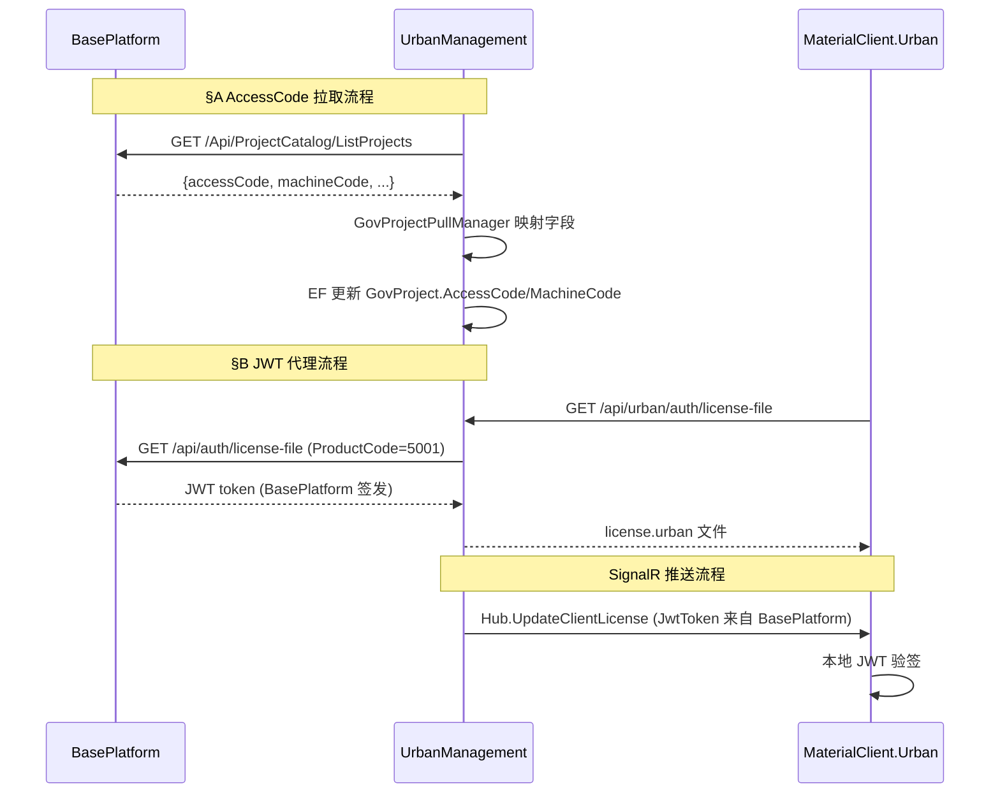

# UrbanManagement 迁移提案 V2

## Why

当前 UrbanManagement 服务端存在两个关键的技术债务：(1) `GovProject.BuildLicenseNo` 字段语义不清晰，应为 `AccessCode`（城管接入码），且缺少 `MachineCode` 和 `AuthToken` 字段；(2) JWT 授权令牌由 UrbanManagement 本地签发，存在密钥管理风险且无法与 BasePlatform 授权体系统一。此迁移旨在优化数据语义并下线本地 JWT 签发，委托 BasePlatform 统一管理。

## What Changes

### §A AccessCode 数据语义迁移

- **BREAKING**：`GovProject.BuildLicenseNo` 字段重命名为 `AccessCode`（EF 迁移）
- 新增 `GovProject.MachineCode` 和 `GovProject.AuthToken` 可空字符串字段
- 更新 `GovProjectPullManager` 映射：从 BasePlatform PublicApi 的 `accessCode`、`machineCode` 字段拉取（不再读 `buildLicenseNo`）
- 政府平台出站协议保持 `payload.buildLicenseNo = govProject.AccessCode`（协议名不变）
- 实施脏数据修复脚本：以 BasePlatform 拉取结果覆盖本地 `AccessCode`

### §B JWT 签发下线与代理

- **BREAKING**：删除 `UrbanLicenseGenerator` 本地 JWT 签发逻辑（移除 RSA 私钥依赖）
- 新增代理 API：`GET /api/urban/auth/license-file` → 调用 BasePlatform PublicApi `/api/auth/license-file` 透传 JWT
- 更新 `DeviceStatusHub.GetClientProjectLicenseInfo` 和 SignalR 推送：JWT 由 BasePlatform 签发，Urban 仅转发
- 移除 `appsettings.json` 中 `Jwt:PrivateKey` 配置
- 保留 Feature Flag（`UseBasePlatformJwtIssuer`）支持灰度回退

### 影响范围

- **UrbanManagement**（`repos/UrbanManagement/`）：
  - `UrbanManagement.Core/Entities/GovProject.cs`：字段重命名+新增
  - `UrbanManagement.Core/Services/GovProjectPullManager.cs`：映射字段调整
  - `UrbanManagement.Core/Services/UrbanLicenseGenerator.cs`：删除或标记 `[Obsolete]`
  - `UrbanManagement.Core/Services/GovProjectLicenseAppService.cs`：改为代理调用 BasePlatform
  - `UrbanManagement.Core/Services/JwtAntiTamperService.cs`：验签后转发 BasePlatform JWT
  - `UrbanManagement.Core/Hubs/DeviceStatusHub.cs`：推送 JWT 来自 BasePlatform
  - `UrbanManagement.Core/Api/IBasePlatformProjectHttpClient.cs`：`ProjectCatalogItemResponse` 新增 `AccessCode`、`MachineCode` 字段
  - `UrbanManagement.Core/EntityFrameworkCore/`：EF 迁移脚本

- **BasePlatform PublicApi**（独立仓库，本提案仅更新 spec 描述）：
  - `/Api/ProjectCatalog/ListProjects` 响应新增 `accessCode`、`machineCode` 字段
  - `/api/auth/license-file` 签发 Urban 产品 JWT（ProductCode=5001）

- **MaterialClient**（`repos/MaterialClient/`）：
  - `MaterialClient.Common/Entities/LicenseInfo.cs`：字段 `BuildLicenseNo` 保持不变（客户端属性重命名可后续单独立项）
  - 客户端以本地 JWT 验签为准，无需 verify API 门禁

## Capabilities

### New Capabilities

- `urban-accesscode-migration`：`GovProject.BuildLicenseNo` → `AccessCode` 字段重命名与数据迁移
- `urban-jwt-delegation`：JWT 签发委托 BasePlatform，本地下线 `UrbanLicenseGenerator`

### Modified Capabilities

- `gov-project-baseplatform-pull-sync`：拉取映射字段从 `buildLicenseNo` 改为 `accessCode`、`machineCode`
- `jwt-anti-tamper`：验签后不再使用 `UrbanLicenseGenerator` 重新签发，直接返回 BasePlatform JWT

## Code Change Table

| 仓库 | 文件路径 | 变更类型 | 变更原因 | 影响范围 |
|------|---------|---------|---------|---------|
| **UrbanManagement** | `src/UrbanManagement.Core/Entities/GovProject.cs` | **BREAKING** 字段重命名+新增 | 数据语义优化 | EF 实体、数据库迁移 |
| **UrbanManagement** | `src/UrbanManagement.Core/Services/GovProjectPullManager.cs` | 修改映射逻辑 | 对接 BasePlatform 新字段 | 拉取同步服务 |
| **UrbanManagement** | `src/UrbanManagement.Core/Services/UrbanLicenseGenerator.cs` | **BREAKING** 删除或标记 Obsolete | 下线本地 JWT 签发 | 授权生成服务 |
| **UrbanManagement** | `src/UrbanManagement.Core/Services/GovProjectLicenseAppService.cs` | 改为代理调用 | 委托 BasePlatform 签发 | 授权文件下载 API |
| **UrbanManagement** | `src/UrbanManagement.Core/Services/JwtAntiTamperService.cs` | 修改验签后行为 | 转发 BasePlatform JWT | JWT 防篡改服务 |
| **UrbanManagement** | `src/UrbanManagement.Core/Hubs/DeviceStatusHub.cs` | SignalR 推送 JWT 来源 | 推送 BasePlatform JWT | 客户端 JWT 同步 |
| **UrbanManagement** | `src/UrbanManagement.Core/Api/IBasePlatformProjectHttpClient.cs` | 新增响应字段 | 接收 `AccessCode`、`MachineCode` | BasePlatform HTTP 客户端 |
| **UrbanManagement** | `src/UrbanManagement.Core/EntityFrameworkCore/` | 新增 EF 迁移 | 数据库字段变更 | SQLite 数据库结构 |
| **BasePlatform** | `PublicApi/ProjectCatalogController.cs` | 新增响应字段 | 返回 `accessCode`、`machineCode` | 目录 API（本提案仅更新 spec） |
| **BasePlatform** | `PublicApi/AuthController.cs` | 新增 Urban JWT 签发 | 支持 ProductCode=5001 | 授权 API（本提案仅更新 spec） |

## Interaction Flow

## Migration Strategy

### §A AccessCode 迁移步骤

1. **EF 迁移**：生成 `BuildLicenseNo → AccessCode` 重命名脚本 + 新增 `MachineCode`、`AuthToken` 列
2. **Pull Worker 更新**：`GovProjectPullManager.ApplyRemoteFieldsIfChanged` 改为映射 `AccessCode`、`MachineCode`
3. **脏数据修复**：执行 SQL 脚本以 BasePlatform 拉取结果覆盖本地 `AccessCode`（可后台任务执行）
4. **依赖条件**：BasePlatform PublicApi 已输出 `accessCode`、`machineCode` 字段（见 02-BasePlatform 提案 P1）

### §B JWT 下线步骤

1. **BasePlatform HTTP 客户端**：新增 `IBasePlatformAuthHttpClient.GetLicenseFileAsync` 调用
2. **代理 API**：`GovProjectLicenseAppService.GenerateAsync` 改为调用 BasePlatform 并透传 JWT
3. **SignalR 更新**：`DeviceStatusHub` 推送的 `JwtToken` 字段来自 BasePlatform 签发
4. **Feature Flag**：`UseBasePlatformJwtIssuer=true` 启用新路径，灰度验证后移除旧代码
5. **依赖条件**：BasePlatform `/api/auth/license-file` 支持 Urban 产品（ProductCode=5001）

### Rollback 策略

- **§A**：保留 `BuildLicenseNo` 列只读别名一版（EF 兼容属性），便于数据回滚
- **§B**：`UseBasePlatformJwtIssuer=false` 恢复 Urban 本地签发（P4 验证完成前）

## Non-Goals

- **不包含**：BasePlatform 表结构变更、授权后台 UI（见 02、03 提案）
- **不包含**：客户端 `LicenseInfo.BuildLicenseNo` 属性重命名（可后续单独立项）
- **不包含**：政府平台协议字段改名（仍叫 `buildLicenseNo`）
- **不包含**：`POST /api/urban/auth/verify` 在线激活代理（见 05-联合发版说明）
