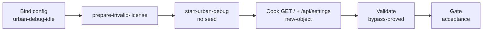

# urban-debug-license-bypass（urban）

> **Retired 2026-09**：`UrbanDebugDevelopmentAuthorization` 已移除；授权改由 `pipelines/_shared/urban/Invoke-UrbanLicenseSeed.ps1`（`UpsertLicenseInfo`）在启动前灌入。继任验收：`graphs/urban/urban-passage-probe/`。

## 目的 / Goal

验证 **MaterialClient.Urban Debug** 在本地 **无有效 JWT / 畸形 `license.urban`**、且 **未 seed 演示授权** 时，仍能完成启动授权旁路并拉起诊断 Host（`MinimalWebHost`），从而证明 `update-urban-debug-license-bypass` 的开发授权上下文生效。

Goal 槽：`urban-debug-license-bypass`

Status: **active**

路径：`pipelines/graphs/urban/urban-debug-license-bypass/`（见 [`pipelines/AGENTS.md`](../../../AGENTS.md)）

OpenSpec：`openspec/changes/update-urban-debug-license-bypass/`

## 非目标

- 不修改 `repos/` 业务代码
- 不提交 secrets / runs
- 不替代 OpenSpec 与 CI
- Agent 不宣布 L3 通过
- 不覆盖 `urban-passage-probe`（LPR 灌数另图）
- **不**在本 Graph cook Release 严格失败路径（文档注明即可；Release 仍须有效授权）

## 配置指针

- `./config.yaml`
- `./secrets.local.yaml`（gitignore；可选覆盖 `baseUrl`）
- `./secrets.example.yaml`
- 启动复用：`../urban-passage-probe/scripts/Start-UrbanForProbe.ps1`（Debug 默认跳过 license seed）
- 源码指针：
  - `repos/MaterialClient/src/MaterialClient.Urban/MaterialClientUrbanModule.cs`
  - `repos/MaterialClient/src/MaterialClient.Urban/Services/UrbanDebugDevelopmentAuthorization.cs`
  - `repos/MaterialClient/src/MaterialClient.Urban/Services/MinimalWebHostService.cs`

## Sockets

| | |
|--|--|
| Start | `urban-debug-idle` |
| End | `bypass-proved` |
| Cook | `new-object` |

## Context

- **指针**：诊断 `baseUrl`（默认 `http://localhost:9961`）；`GET /`、`GET /api/settings`
- **指纹**：HTTP 200；prepare 记录显示 `seedSkipped=true` 且 `license.urban` 为畸形内容
- **显示名**：仅人读
- **前置**：Debug 构建含授权旁路；人闸确认无冲突进程或允许重启
- **歧义**：停并问用户

## 状态机 / Cook chain



编号步骤（与 `config.yaml` 1:1）：

1. **bind-config** — 读 config/secrets；建 `runs/<ts>/`
2. **prepare-invalid-license** — 在 Urban Debug 输出目录写入畸形 `license.urban`；**不**调用 `Invoke-UrbanLicenseSeed`
3. **start-urban-debug** — Debug build + 启动（`MinimalWebHost__EnableOnStartup=true`）
4. **cook-probe-host** — `GET /`、`GET /api/settings`；落盘 `http/`
5. **validate-bypass** — L0/L1/L2 断言；写 `summary.json` / `report.md`

失败策略：`retries: 1`；`stopOnError: false`。

## 证据包

相对本次 `runs/<yyyy-MM-ddTHHmmss>/`：

| collector | required | sink |
|-----------|----------|------|
| prepare | true | `prepare/invalid-license.json` |
| request-response | true | `http/01-root.json`、`http/02-settings-get.json` |
| summary | true | `summary.json` |
| report | true | `report.md` |
| logs | true | `logs/bypass-marker.json` + `logs/serilog/MaterialClient.Urban-*.log`（递归 `Logs/yyyy/MM/dd/`） |

缺证仍写文件：`source: missing` / `count: 0`。

## Invoke

仅准备畸形 license + 启动 Debug（不 seed）：

```powershell
powershell -ExecutionPolicy Bypass -File `
  pipelines/graphs/urban/urban-debug-license-bypass/scripts/Start-UrbanDebugForBypassProbe.ps1
```

完整 probe（准备 → 启动 → HTTP 采证 → summary）：

```powershell
powershell -ExecutionPolicy Bypass -File `
  pipelines/graphs/urban/urban-debug-license-bypass/scripts/Invoke-UrbanDebugLicenseBypassProbe.ps1
```

或：`/run-pipeline urban/urban-debug-license-bypass`

## 人闸 / Gate

- Urban 已在跑且非本 Graph 启动 → 确认是否结束旧进程
- 必须使用 **Debug** 构建；误用 Release 且无有效授权时 Host 不可达是预期
- L3：用户确认主窗可用、未卡在激活恢复

## 判定级别

| 级 | 谁判 |
|----|------|
| L0 | Agent — `GET /` 可达 |
| L1 | Agent — `GET /api/settings` 200 |
| L2 | Agent — 无有效 JWT seed 仍可达（prepare 证据） |
| L3 | **用户** — 主窗 / 无激活阻断 |

## Handoff

Output socket：`bypass-proved`。下游若做 LPR 灌数，接 `urban/urban-passage-probe`（彼图可假设 Debug 已旁路，不必再依赖有效 license）。
