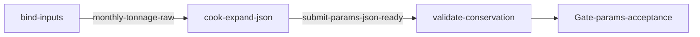

# sand-addbatch-2026-01（govsync / XNYH20251113001）

## 目的 / Goal

生成 **2026 年 1 月** §2.2 `addBatch` **拟提交参数 JSON**，供用户验收字段后再决定是否另图 POST。

- **本图禁止提交**（`submitEnabled: false`；脚本不得 HTTP）
- 产物为 JSON（车次 Array + `submit-meta.json`）
- 照片：JSON 内写 `outPhotosPath`；**不**写 Base64（避免超大文件）

Goal 槽：`gov-sand-product-addbatch-2026-01`

Status: **active**

路径：`pipelines/graphs/govsync/XNYH20251113001/sand-addbatch-2026-01/`

站点：`PointNumber=XNYH20251113001`（见 [`../AGENTS.md`](../AGENTS.md)）

方案：[docs/2026-09-07-sand-product-transport-addbatch-mock](../../../../../docs/2026-09-07-sand-product-transport-addbatch-mock/00-调研总览.md)

## 非目标

- **禁止**对本图目标 URL 做任何 POST / HMAC 实发
- 不改 `repos/` 业务代码
- 不导出 2–5 月（另开 goal / slug）
- 不提交 secrets / runs / 现场 jpg / 大 Base64
- Agent 不宣布 L3 通过

## 配置指针

- `./config.yaml`（`submitEnabled: false`，`outputFormat: json`）
- `./seeds/monthly-totals.yaml`
- Q9 池：`pipelines/graphs/materialclient/recycle-wenyixilu-export/out/latest/csv/`
- `./secrets.local.yaml`（仅预留；本图不用）
- Node：`./scripts/expand-january.mjs`（experimental）
- Invoke：`./scripts/Invoke-SandAddbatch202601.ps1`（experimental）

## 前置

1. Node.js 22.5+
2. 已跑过 `recycle-wenyixilu-export`，`out/latest/csv` 存在

## Sockets

| | |
|--|--|
| Start | `monthly-tonnage-raw` |
| End | `submit-params-json-ready` |
| Cook | `new-object` |

## Context

- 指针：`target.baseUrl` + `pointNumber=XNYH20251113001`
- 验收对象：JSON 内 `dataNo` / `carNo` / `productName` / 净皮毛 / `outTime` / `consignee` / `outPhotosPath`

## 状态机 / Cook chain



1. **bind-inputs** — 种子 + 池 + PointNumber
2. **cook-expand-json** — 拆分并写 `json/*.json` + `submit-meta.json`（**无 HTTP**）
3. **validate-conservation** — L0–L2
4. **Gate** — 用户验收拟提交参数

## 证据包（JSON 产物）

相对 `runs/<yyyy-MM-ddTHHmmss>/`：

| collector | sink | 说明 |
|-----------|------|------|
| prepare | `prepare/` | 工作副本 |
| json | `json/` | 拟提交车次 Array（按收货公司分片） |
| submitMeta | `submit-meta.json` | URL/method/pointNumber；`submitEnabled:false` |
| manifest | `photo-manifest.jsonl` | 图路径与昼夜对齐 |
| summary | `summary.json` | |
| report | `report.md` | |

镜像：`out/latest/`（gitignore）。

单条 JSON 字段（验收用）：`dataNo` `dataStatus` `pointNumber` `carNo` `productName` `netWeight` `tareWeight` `grossWeight` `outTime` `consignee` `outPhotosPath`；`outPhotos` 固定 `null`（正式提交前再 embed）。

## Invoke

```powershell
powershell -ExecutionPolicy Bypass -File `
  pipelines/graphs/govsync/XNYH20251113001/sand-addbatch-2026-01/scripts/Invoke-SandAddbatch202601.ps1
```

命令：`/run-pipeline govsync/XNYH20251113001/sand-addbatch-2026-01`

## 人闸 / Gate

请验收拟提交参数：`pass` / `fail` + 对象与原因。  
通过后另开 submit Graph（本图永不自动 POST）。

## 判定级别

| 级 | 谁判 |
|----|------|
| L0 种子/池可达 | Agent |
| L1 吨位守恒 | Agent 提示 |
| L2 JSON 形态 + 昼夜 | Agent 提示 |
| L3 参数可提交性 | **用户** |

## Handoff

Output：`submit-params-json-ready`。下游 submit Graph 读取本 run 的 `json/`，再 HMAC POST。
