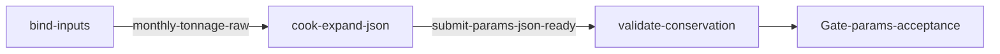

# sand-addbatch-2026-04（govsync / XNYH20251113001）

## 目的 / Goal

生成 **2026 年 4 月** §2.2 `addBatch` **待 POST JSON**（含 `consigneeAddress`、`receivingTime` Q10、持久化 `dataNo` 台账），供用户验收后再另图提交。

- **本图禁止提交**（`submitEnabled: false`；脚本不得 HTTP）
- 产物：`json/*.json` + `ledgers/dataNo-ledger.jsonl` + `submit-meta.json`
- `dataNo`：`fl-{pointNumber小写}-{yyyyMMddHHmmss}-{seq}`（例 `fl-xnyh20251113001-…`）
- 照片：JSON 内写 `outPhotosPath`；**不**写 Base64（正式 POST 另图 embed）
- 车载：**Q5** 净~50 / 皮~20 / 毛~70（`48–52` / `19–21` / `67–73`）

Goal 槽：`gov-sand-product-addbatch-2026-04`（与其它月图 **互异 goal**；每月独立 Graph）

Status: **active**（2026-09-10 自 `sand-addbatch-2026-02` 派生）

路径：`pipelines/graphs/govsync/XNYH20251113001/sand-addbatch-2026-04/`

站点：`PointNumber=XNYH20251113001`（见 [`../AGENTS.md`](../AGENTS.md)）

方案：[docs/2026-09-07-sand-product-transport-addbatch-mock](../../../../../docs/2026-09-07-sand-product-transport-addbatch-mock/00-调研总览.md)

**Q11**：五家 `activeDayRate` 档位互异；每月抽 **2～4** 个周末日全场低/零活跃。

## 非目标

- **禁止**对本图目标 URL 做任何 POST / HMAC 实发
- 不改 `repos/` 业务代码
- 不导出其它月份（每月独立 slug / goal）
- 不提交 secrets / runs / 现场 jpg / 大 Base64
- Agent 不宣布 L3 通过

## 配置指针

- `./config.yaml`（`submitEnabled: false`，`month: 4`，`outputFormat: json`）
- `./seeds/monthly-totals.yaml`（展开 `months[4]`）
- `./seeds/consignee-addresses.yaml`
- Q9 池：`pipelines/graphs/materialclient/recycle-wenyixilu-export/out/latest/csv/`
- `./secrets.local.yaml`（仅预留；本图不用）
- Node/TS：`./scripts/expand-april.ts`（experimental；`pnpm exec tsx`）
- Invoke：`./scripts/Invoke-SandAddbatch202604.ps1`（experimental）

## 前置

1. Node.js 22.5+；`pipelines/` 下可 `pnpm exec tsx`
2. 已跑过 `recycle-wenyixilu-export`，`out/latest/csv` 存在

## Sockets

| | |
|--|--|
| Start | `monthly-tonnage-raw` |
| End | `submit-params-json-ready` |
| Cook | `new-object` |

## Context

- 指针：`target.baseUrl` + `pointNumber=XNYH20251113001`
- 4 月目标合计约 **108126.07** t（五家 `months[4]`）
- 验收：`dataNo` / `carNo` / `productName` / 净皮毛 / `outTime` / `receivingTime`(Q10) / `consignee` / `consigneeAddress` / `outPhotosPath` / 台账

## 状态机 / Cook chain



1. **bind-inputs** — 种子 + 地址 + 池 + PointNumber
2. **cook-expand-json** — 拆分并写 `json/` + `ledgers/` + `submit-meta.json`（**无 HTTP**）
3. **validate-conservation** — L0–L2
4. **Gate** — 用户验收待 POST 参数

## 证据包

相对 `runs/<yyyy-MM-ddTHHmmss>/`：

| collector | sink | 说明 |
|-----------|------|------|
| prepare | `prepare/` | 工作副本 |
| json | `json/` | 待 POST 车次 Array（按收货公司分片） |
| ledger | `ledgers/dataNo-ledger.jsonl` | Q7 持久化 `dataNo` |
| submitMeta | `submit-meta.json` | URL/method；`submitEnabled:false` |
| manifest | `photo-manifest.jsonl` | 图路径与昼夜对齐 |
| summary | `summary.json` | |
| report | `report.md` | |

镜像：`out/latest/`（gitignore）。

## Invoke

```powershell
powershell -ExecutionPolicy Bypass -File `
  pipelines/graphs/govsync/XNYH20251113001/sand-addbatch-2026-04/scripts/Invoke-SandAddbatch202604.ps1
```

默认：**全量生成**（4 月尚无已提交账本；勿默认套其它月 preserve）。  
可选：`-Preserve` + 提供 `state/2026-04/submit-state.jsonl` 后可续跑重拆。

命令：`/run-pipeline govsync/XNYH20251113001/sand-addbatch-2026-04`

## 人闸 / Gate

请验收待 POST 参数：`pass` / `fail` + 对象与原因。  
通过后拷贝到 **`sand-addbatch-submit/seeds/2026-04/source-run/<runId>/`**，再 HMAC POST（submit 图按月分仓；**不**与 1 月混跑）。

## 判定级别

| 级 | 谁判 |
|----|------|
| L0 种子/地址/池可达 | Agent |
| L1 吨位守恒 | Agent 提示 |
| L2 JSON 形态 + dataNo + 台账 + 昼夜 | Agent 提示 |
| L3 参数可提交性 | **用户** |

## Handoff

Output：`submit-params-json-ready`。下游 **`sand-addbatch-submit`** 切换 `source.month=2026-04` 后读取冻结源。

接口空数组通路探测：另图 `govsync/recycle-hmac-auth`。
