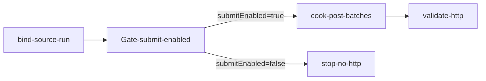

# sand-addbatch-submit（govsync / XNYH20251113001）

## 目的 / Goal

读取 transform Graph `sand-addbatch-2026-01` 的待 POST 产物，对 §2.2 `productTransportRecord/v1/addBatch` 做 **HMAC 提交**（含烟测 / 续跑 / 状态账）。

Goal 槽：`gov-sand-product-addbatch-submit`

Status: **active**（骨架已落；**默认禁止自动 POST**）

路径：`pipelines/graphs/govsync/XNYH20251113001/sand-addbatch-submit/`

站点：`PointNumber=XNYH20251113001`（见 [`../AGENTS.md`](../AGENTS.md)）

上游：`../sand-addbatch-2026-01/`（transform；禁 HTTP）

## 硬约束

- **默认 `submitEnabled: false`**：Invoke **必须拒绝** HTTP，除非用户显式打开开关并过闸
- Agent / cook **不得**在未授权时自动 POST
- 执行态写入本图 `submit-state.jsonl` / `submit-log.jsonl`，**不**改写车次 JSON 载荷
- 接口通路烟测优先用已有 `govsync/recycle-hmac-auth`（空数组 `[]`）；本图烟测为「1 条真车次」模式（另闸）

## 非目标

- 不重新拆分月吨位（那是 transform）
- 不宣布 L3 通过
- 不把 Base64 / secrets / runs 提交进 git

## 配置指针

- `./config.yaml`（`submitEnabled: false`）
- `./secrets.example.yaml` → `secrets.local.yaml`
- 冻结输入：`./seeds/source-run/2026-09-09T152356/`（自 transform run 拷贝）
- 方案：[docs/2026-09-07-sand-product-transport-addbatch-mock](../../../../../docs/2026-09-07-sand-product-transport-addbatch-mock/00-调研总览.md)

## Sockets

| | |
|--|--|
| Start | `submit-params-json-ready` |
| End | `submit-recorded` |
| Cook | `new-object` |

## Context

- 指针：`target.baseUrl` + `path`（与 transform `submit-meta.json` 一致）
- 输入：`seeds/source-run/<runId>/json/*.json` + `ledgers/dataNo-ledger.jsonl`
- 预处理（仅当真正 POST）：`outPhotosPath` → Base64 → `outPhotos`；剥掉 `outPhotosPath`
- 状态：`status ∈ {pending, smoke-posted, posted, failed, skipped}` + `attemptedAt`

## 状态机 / Cook chain



1. **bind-source-run** — 校验冻结 run / ledger / secrets 可读
2. **Gate** — `submitEnabled` 人闸；默认 stop
3. **cook-post-batches** —（未启用）分批 HMAC POST；写 state/log
4. **validate** — HTTP / platform `code`

## 证据包（将来 cook 时）

相对 `runs/<yyyy-MM-ddTHHmmss>/`：

| sink | 说明 |
|------|------|
| `http/` | 请求元信息 + 响应（红acted；勿存全量 Base64） |
| `submit-state.jsonl` | 按 `dataNo` / part 的执行态 |
| `submit-log.jsonl` | 每次 HTTP 尝试 |
| `summary.json` / `report.md` | |

## 已冻结源 run

| 字段 | 值 |
|------|-----|
| sourceRunId | `2026-09-09T152356` |
| 路径 | `seeds/source-run/2026-09-09T152356/` |
| 来源 | `../sand-addbatch-2026-01/runs/2026-09-09T152356/` |

## Invoke

```powershell
# 默认：只校验输入，不 POST
powershell -ExecutionPolicy Bypass -File `
  pipelines/graphs/govsync/XNYH20251113001/sand-addbatch-submit/scripts/Invoke-SandAddbatchSubmit.ps1

# 真正 POST 前必须：config.submitEnabled=true 且显式 -AllowPost（脚本内仍再闸）
```

命令：`/run-pipeline govsync/XNYH20251113001/sand-addbatch-submit`（当前仅 bind/校验）

## 人闸 / Gate

- `submitEnabled` 确认（默认 false）
- `environment: shared` 现网确认
- smoke / 全量确认
- L3 仅用户

## 判定级别

| 级 | 谁判 |
|----|------|
| L0 源 run / secrets 可达 | Agent |
| L1 未在 `submitEnabled=false` 时发出 HTTP | Agent |
| L2（启用后）平台响应可解析 | Agent 提示 |
| L3 业务可接受 | **用户** |
