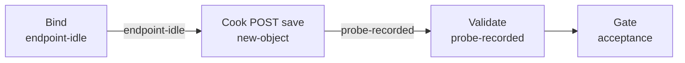

# postweight（govsync）

## 目的 / Goal

向政府平台 `inoutRecord/save` 用固定夹具发起可重复 POST，采证请求/响应，证明出站契约可达且业务 `code` 可判。

Goal 槽：`gov-inout-record-save`

Status: **active**

路径：`pipelines/graphs/govsync/postweight/`（见 [`pipelines/AGENTS.md`](../../../AGENTS.md)）

若替换旧验法：retired ← （无）

## 非目标

- 不修改 `repos/` 业务代码
- 不提交 secrets / runs
- 不替代 OpenSpec 与 CI
- Agent 不宣布 L3 通过
- 不走 UrbanManagement 入库 / `GovSyncBackgroundWorker` 全链路（本 Graph 直连政府 URL）

## 配置指针

- `./config.yaml`
- `./secrets.local.yaml`（gitignore；本场景默认可空）
- `./secrets.example.yaml`
- `./design-brief.md`
- 夹具：`./fixtures/test_pic.jpg`

## Sockets

| | |
|--|--|
| Start | `endpoint-idle` |
| End | `probe-recorded` |
| Cook | `new-object`（每次 `runs/<ts>/` 证据包） |

## Context

- **指针**：`target.url` = `http://191.12.15.58:8899/sapi/v1/inoutRecord/save`（用户提供；与联调文档一致）
- **指纹**：请求体字段对齐 `GovSyncWeightPayload`；响应须含 `code`/`msg`；成功启发式 `code == 200`
- **场景固定值**：对接码 `XNXS20250819001` → `buildLicenseNo`；车牌 `浙A12345`；重量 `20t` = `20000` kg；黄牌 `carNoColor=黄`
- **时间**：`snapTimeMode: run-now` — **每次 run** 取本机当前时间，格式 `yyyy-MM-dd HH:mm:ss`
- **显示名**：仅人读，禁止当唯一键
- **歧义**：停止并问用户（例如 URL 变更、对接码含义改为 `fdBuildLicenseNo` 等）

## 状态机 / Cook chain



编号步骤（与 `config.yaml` 1:1）：

1. **bind-endpoint** — 解析 `target.url`、读 `fixtures/test_pic.jpg`、装载 `scenario.*`；缺夹具则停。
2. **cook-post** — 组装 JSON payload（`snapTime` = 本机 now；`snapImages` = `[base64]`）；`POST` 到政府地址；先挂钩 collector 再发请求。
3. **validate-response** — 落盘 HTTP 状态、耗时、业务 `code`/`msg`；对照 `expect` L0–L2；写 `report.md`，状态=等待验收。

失败策略：`retries: 2`；`stopOnError: true`。

### Payload 形状（对齐联调 + 用户参数）

| 字段 | 值 |
|------|-----|
| carNo | 浙A12345 |
| carNoColor | 黄 |
| buildLicenseNo | XNXS20250819001 |
| inOutType | 0 |
| grossWeight | 20000 |
| tareWeight | 0 |
| goodsWeight | `"20000"` |
| carType | 大车 |
| deviceID | 01 |
| siteType | 1 |
| areaCode | 330109 |
| snapTime | run 时当前时间 |
| snapImages | `[ <test_pic.jpg Base64> ]` |
| equipmentNumber / equipmentType | 省略或 null（与 `WhenWritingNull` 一致） |

## 证据包

相对本次 `runs/<yyyy-MM-ddTHHmmss>/`：

| collector | required | sink |
|-----------|----------|------|
| request-response | true | `http/request.meta.json`、`http/response.json`、`http/response.raw.txt` |
| summary | true | `summary.json` |
| report | true | `report.md` |
| acceptance 副本 | true | `acceptance.md`（pending） |

`snapImages` 在证据中只保留 `count` 与近似字节长度，不落完整 Base64。缺证仍写文件：`source: missing` / `count: 0`。

## Invoke

- 命令：`/run-pipeline govsync/postweight`（或 `/run-probe-pipeline postweight`）
- 脚本（**experimental**）：

```powershell
powershell -ExecutionPolicy Bypass -File pipelines/graphs/govsync/postweight/scripts/Invoke-GovSyncPostWeight.ps1
```

可选：`-RunDir <绝对路径>` 指定已建好的 run 目录；默认在 `runs/` 下新建时间戳目录。

## 人闸 / Gate

- 缺密钥 / Context 歧义
- **`environment: shared` 确认**（非 local）
- **破坏性确认**：`POST .../save` 会向政府平台写入一条入出库记录
- 最终验收：用户 `pass` / `fail` + 对象与原因

## 判定级别

| 级 | 谁判 |
|----|------|
| L0 可达 | Agent（HTTP 有响应） |
| L1 非空壳 | Agent 提示（JSON 含 code/msg） |
| L2 契约可见 | Agent 提示（code==200） |
| L3 业务正确 | **用户** |

## Handoff

Output socket：`probe-recorded`。下游若要接，须声明对齐该态（例如 reconcile 对平台查询结果，本 Graph 不包含）。
