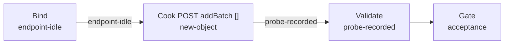

# recycle-hmac-auth（govsync）

## 目的 / Goal

探测 **RecycleSync HMAC**（`AccessKey` / `SecretKey`）对杭州市资源化利用厂 exapi 是否可用。

Cook：对产品同款端点 `POST /dataCenter/resourcePlace/productTransportRecord/v1/addBatch` 发送 **空 JSON Array `[]`**，注入 `X-AKZTJG-*` 四头（算法对齐 `ResourcePlaceHmacSigner`）。空数组预期不入库；用「鉴权拒绝 vs 业务校验」区分密钥是否被平台接受。

Goal 槽：`gov-recycle-hmac-auth`

Status: **active**

路径：`pipelines/graphs/govsync/recycle-hmac-auth/`（见 [`pipelines/AGENTS.md`](../../../AGENTS.md)）

## 非目标

- 不提交真实车次 / 不测 `PointNumber` 绑定（HMAC 不签该字段）
- 不打 §2.3 物料进场或其它 addBatch
- 不修改 `repos/`；不宣布 L3

## 配置指针

- `./config.yaml`（`target.baseUrl` / `path` 来自用户 `RecycleSync:ApiUrl` + `IRecycleDataApi`）
- `./secrets.example.yaml` → `secrets.local.yaml`（`accessKey` / `secretKey`）
- 签名：[`ResourcePlaceHmacSigner.cs`](../../../../repos/MaterialClient/src/MaterialClient.Common/Utils/ResourcePlaceHmacSigner.cs)
- 规范：[`recycle-hmac-authentication`](../../../../openspec/specs/recycle-hmac-authentication/spec.md)
- 接口文档：[`杭州市资源化利用厂数据接入接口V1.0.md`](../../../../docs/SyncDoc/杭州市资源化利用厂数据接入接口V1.0.md) §2.2 + 附录

## Sockets

| | |
|--|--|
| Start | `endpoint-idle` |
| End | `probe-recorded` |
| Cook | `new-object` |

## Context

- **指针**：`config.yaml` → `target.baseUrl` + `target.path`
- **鉴权**：`secrets.local.yaml` 的 `accessKey` / `secretKey`；Header `X-AKZTJG-*`
- **厂标识**：`scenario.pointNumber` 仅记录，不参与本 probe 判定
- **响应**：`{ code, msg, data }`（`code == 200` 成功；鉴权失败常见 401/403 或 msg 含签名/鉴权）

## 状态机 / Cook chain



1. **bind-endpoint** — 读 config / secrets；拼完整 URL
2. **cook-post** — UTC RFC 1123 时间戳 + HMAC-SHA256；POST `[]`
3. **validate-response** — L0 HTTP / L1 JSON / L2 HMAC 被接受

## 证据包

相对本次 `runs/<yyyy-MM-ddTHHmmss>/`：

| collector | required | sink |
|-----------|----------|------|
| request-response | true | `http/`（密钥与签名头脱敏） |
| summary | true | `summary.json` |

## Invoke

```powershell
powershell -ExecutionPolicy Bypass -File pipelines/graphs/govsync/recycle-hmac-auth/scripts/Invoke-RecycleHmacAuth.ps1
```

或 `/run-pipeline govsync/recycle-hmac-auth`

脚本标 **experimental**。

## 人闸 / Gate

- `environment: shared`（现网 `gzt.cgw.hangzhou.gov.cn`）
- 缺 `secrets.local.yaml` 的 `accessKey` / `secretKey` 则停
- L3 仅用户

## 判定级别

| 级 | 谁判 |
|----|------|
| L0 可达 | Agent |
| L1 JSON `code`/`msg` | Agent 提示 |
| L2 HMAC 被平台接受（非鉴权拒绝） | Agent 提示 |
| L3 密钥即现场 RecycleSync 要用的那套 | **用户** |
