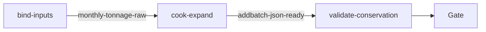

# sand-addbatch-2026-01（govsync）

## 目的 / Goal

按方案 [docs/2026-09-07-sand-product-transport-addbatch-mock](../../../../docs/2026-09-07-sand-product-transport-addbatch-mock/00-调研总览.md)，将 **2026 年 1 月** 五家收货公司成品月吨位拆成 §2.2 `productTransportRecord/v1/addBatch` 车次 JSON（产品 **再生细骨料** / **再生粉料** 1:1；**dryRun 默认**，不 POST）。

Goal 槽：`gov-sand-product-addbatch-2026-01`

Status: **active**

路径：`pipelines/graphs/govsync/sand-addbatch-2026-01/`

## 非目标

- 不真实 POST 市平台（鉴权探测见 `govsync/recycle-hmac-auth`；正式提交另闸）
- 不改 `repos/` 业务代码
- 不导出 2–5 月（另开 goal / slug）
- 不提交 secrets / runs / 现场 jpg / 大 Base64
- Agent 不宣布 L3 通过

## 配置指针

- `./config.yaml`（`scenario.month: 1`，`dryRun: true`）
- `./seeds/monthly-totals.yaml`（来自方案 01 表）
- Q9 池：`pipelines/graphs/materialclient/recycle-wenyixilu-export/out/latest/csv/`
- `./secrets.example.yaml`（可选 `pointNumber`；POST 另议）
- Node：`./scripts/expand-january.mjs`（experimental）
- Invoke：`./scripts/Invoke-SandAddbatch202601.ps1`（experimental）

## 前置

1. Node.js 22.5+
2. 已跑过 `recycle-wenyixilu-export`，`out/latest/csv` 存在且含 `photoFound=true` 行
3. 本图默认 **不** embed 照片 Base64（写 `photo-manifest.jsonl`）；验收守恒与昼夜对齐

## Sockets

| | |
|--|--|
| Start | `monthly-tonnage-raw` |
| End | `addbatch-json-ready` |
| Cook | `new-object` |

## Context

- 指针：1 月合计 **123344.32** 吨；五收货公司见 seeds
- 指纹：`productName∈{再生细骨料,再生粉料}` 1:1；`dataNo=fl-{yyyyMMddHHmmss}-{D4}`；Q9 dayPart
- 1 月估算车次：约 `123344/21 ≈ 5870` 条

## 状态机 / Cook chain



1. **bind-inputs** — 种子 + 池 CSV
2. **cook-expand** — 拆分算法 + Q9 绑池；写 `dry-run/*.json` + manifest
3. **validate-conservation** — L1/L2 断言进 summary/report

失败策略：`retries: 0`；`stopOnError: true`。

## 证据包

相对 `runs/<yyyy-MM-ddTHHmmss>/`：

| collector | sink |
|-----------|------|
| prepare | `prepare/` |
| dryRun | `dry-run/`（按 consignee 分片 JSON Array） |
| manifest | `photo-manifest.jsonl`（dataNo → plate/path/captureClock） |
| summary | `summary.json` |
| report | `report.md` |

镜像：`out/latest/`（gitignore）。

## Invoke

```powershell
powershell -ExecutionPolicy Bypass -File `
  pipelines/graphs/govsync/sand-addbatch-2026-01/scripts/Invoke-SandAddbatch202601.ps1
```

命令：`/run-pipeline govsync/sand-addbatch-2026-01`

可选：`-EmbedPhotos`（体积大，慎用）。

## 人闸 / Gate

- 缺池 CSV 时停
- L3 仅用户

## 判定级别

| 级 | 谁判 |
|----|------|
| L0 种子/池可达 | Agent |
| L1 吨位守恒 | Agent 提示 |
| L2 形态 + 昼夜 | Agent 提示 |
| L3 业务抽查 | **用户** |

## Handoff

Output：`addbatch-json-ready`。真实 POST 须另开/续用 probe（HMAC）且用户提供 `pointNumber`（Q3）。
