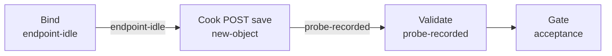

# xiaoshan-gate（govsync）

## 目的 / Goal

萧山卡口进出记录 demo：`POST /sapi/v1/inoutRecord/save`，`buildLicenseNo` 为原值 `L`。

Goal 槽：`gov-xiaoshan-gate-save`

Status: **active**

路径：`pipelines/graphs/govsync/xiaoshan-gate/`（见 [`pipelines/AGENTS.md`](../../../AGENTS.md)）

若替换旧验法：retired ← `graphs/_retired/2026-08/postweight/`

## 非目标

- 不修改 `repos/` 业务代码
- 不提交 secrets / runs
- 不替代 OpenSpec 与 CI
- Agent 不宣布 L3 通过
- 不把地磅字段（`dataSource`、`inOutType`）写入本报文

## 配置指针

- `./config.yaml`
- `./secrets.local.yaml`（gitignore）
- `./secrets.example.yaml`
- 夹具：`./fixtures/test_pic.jpg`
- 设计：`docs/2026-08-27-xiaoshan-weighbridge-gate-product-upload-design/01-设计稿.md`

## Sockets

| | |
|--|--|
| Start | `endpoint-idle` |
| End | `probe-recorded` |
| Cook | `new-object` |

## Context

- **指针**：`http://191.12.15.58:8899/sapi/v1/inoutRecord/save`
- **指纹**：`deviceID`（`01`/`02`）、`siteType`、`areaCode`；`snapImages` 约定 `[大图, 小图]`
- **场景**：`buildLicenseNo=XNXS20250819001`（不加 `-02`）
- **时间**：`snapTimeMode: run-now`

## 状态机 / Cook chain



1. **bind-endpoint**
2. **cook-post** — 卡口 schema；POST
3. **validate-response**

失败策略：`retries: 2`；`stopOnError: true`。

## 证据包

相对本次 `runs/<yyyy-MM-ddTHHmmss>/`：request-response / summary / report / acceptance。

## Invoke

- 命令：`/run-pipeline govsync/xiaoshan-gate`
- 脚本（**experimental**）：

```powershell
powershell -ExecutionPolicy Bypass -File pipelines/graphs/govsync/xiaoshan-gate/scripts/Invoke-XiaoshanUpload.ps1
```

## 人闸 / Gate

- `environment: shared` 确认
- POST save 会写入政府平台
- L3 仅用户

## 判定级别

| 级 | 谁判 |
|----|------|
| L0 可达 | Agent |
| L1 非空壳 | Agent 提示 |
| L2 契约可见 | Agent 提示（code==200） |
| L3 业务正确 | **用户** |

## Handoff

Output socket：`probe-recorded`。成品通道同 URL，见 `xiaoshan-product`。
