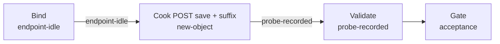

# xiaoshan-product（govsync）

## 目的 / Goal

萧山成品进出记录 demo：与卡口**同一** `POST /sapi/v1/inoutRecord/save` 与字段集；唯一差异 `buildLicenseNo = L + "-02"`。

Goal 槽：`gov-xiaoshan-product-save`

Status: **active**

路径：`pipelines/graphs/govsync/xiaoshan-product/`（见 [`pipelines/AGENTS.md`](../../../AGENTS.md)）

若替换旧验法：retired ← `graphs/_retired/2026-08/postweight/`

## 非目标

- 不修改 `repos/` 业务代码
- 不提交 secrets / runs
- 不替代 OpenSpec 与 CI
- Agent 不宣布 L3 通过
- 不对地磅或卡口原值拼接 `-02`

## 配置指针

- `./config.yaml`
- `./secrets.local.yaml`（gitignore）
- `./secrets.example.yaml`
- 夹具：`./fixtures/test_pic.jpg`
- 设计：`docs/2026-08-27-xiaoshan-weighbridge-gate-product-upload-design/01-设计稿.md`

## Sockets

| | |
|--|--|
| Start | `endpoint-idle` |
| End | `probe-recorded` |
| Cook | `new-object` |

## Context

- **指针**：与卡口相同 URL
- **指纹**：报文 schema 与卡口一致；cook 将 `buildLicenseNo` 变为 `XNXS20250819001-02`（配置已带 `-02` 则不二次拼接）
- **时间**：`snapTimeMode: run-now`

## 状态机 / Cook chain



1. **bind-endpoint**
2. **cook-post** — 卡口 schema + 成品标识变换
3. **validate-response**

失败策略：`retries: 2`；`stopOnError: true`。

## 证据包

相对本次 `runs/<yyyy-MM-ddTHHmmss>/`：request-response / summary / report / acceptance。证据中须可见变换后的 `buildLicenseNo`。

## Invoke

- 命令：`/run-pipeline govsync/xiaoshan-product`
- 脚本（**experimental**）：

```powershell
powershell -ExecutionPolicy Bypass -File pipelines/graphs/govsync/xiaoshan-product/scripts/Invoke-XiaoshanUpload.ps1
```

## 人闸 / Gate

- `environment: shared` 确认
- POST save 会写入政府平台
- L3 仅用户（含 `-02` 场地是否已在平台登记，设计稿 Q2）

## 判定级别

| 级 | 谁判 |
|----|------|
| L0 可达 | Agent |
| L1 非空壳 | Agent 提示 |
| L2 契约可见 | Agent 提示（code==200） |
| L3 业务正确 | **用户** |

## Handoff

Output socket：`probe-recorded`。对照 Graph：`xiaoshan-gate`（同接口、无后缀）。
