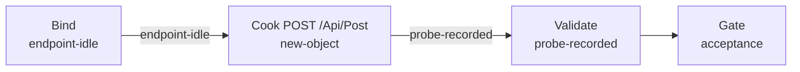

# xiaoshan-serve-apipost（govsync）

## 目的 / Goal

探测现场 **XiaoShanServe** 旧客户端入口：`POST /Api/Post`（[`ApiController`](../../../../repos/Fdsoft.Weight.GovClient/FdSoft.MaterialSys.Gov.XiaoShanServe/Controllers/ApiController.cs) 极薄转发 → UM Legacy）。

报文形状对齐 [`mGovRequestWeight`](../../../../repos/Fdsoft.Weight.GovClient/FdSoft.MaterialSys.Gov.XiaoShanServe/Models/mGovRequestWeight.cs) /
UM `LegacyApiController` 键名（`deviceID`、`grossWeight` number、`inOutType` number 等）。**不是**政府卡口 `inoutRecord/save` schema（无 `areaCode` / `dataSource`）。

Goal 槽：`gov-xiaoshan-serve-api-post`

Status: **active**

路径：`pipelines/graphs/govsync/xiaoshan-serve-apipost/`（见 [`pipelines/AGENTS.md`](../../../AGENTS.md)）

## 非目标

- 不直接打政府地磅/卡口 URL（见 `xiaoshan-weighbridge` / `xiaoshan-gate`）
- 不发送 `fdBuildLicenseNo`（D12 忽略）
- 不修改 `repos/`；不宣布 L3

## 配置指针

- `./config.yaml`
- `./secrets.example.yaml` → `secrets.local.yaml`
- 夹具：`./fixtures/test_pic.jpg`
- 映射：`docs/2026-09-03-xiaoshanserve-forward-to-urban-weighing-record/02-字段映射与缺口.md`

## Sockets

| | |
|--|--|
| Start | `endpoint-idle` |
| End | `probe-recorded` |
| Cook | `new-object` |

## Context

- **指针**：`http://191.12.234.212:8899/Api/Post`
- **通道**：`scenario.channel=legacy-weigh`
- **关键字段**：`buildLicenseNo`、`carNo`、`grossWeight`/`goodsWeight`、`snapTime`、`snapImages[]`、`deviceID`、`siteType`、`inOutType`、`equipmentNumber`/`equipmentType`
- **响应**：`{ success, msg, code }`

## 状态机 / Cook chain



1. **bind-endpoint**
2. **cook-post** — mGov schema；POST Serve
3. **validate-response**

## Invoke

```powershell
powershell -ExecutionPolicy Bypass -File pipelines/graphs/govsync/xiaoshan-serve-apipost/scripts/Invoke-XiaoshanServeApiPost.ps1
```

或 `/run-pipeline govsync/xiaoshan-serve-apipost`

## 人闸 / Gate

- `environment: shared`
- 可能写入 UM `UrbanWeighingRecord` / 拒收暂存
- L3 仅用户

## 判定级别

| 级 | 谁判 |
|----|------|
| L0 可达 | Agent |
| L1 JSON | Agent 提示 |
| L2 code==200 | Agent 提示 |
| L3 UM 入库 | **用户** |
