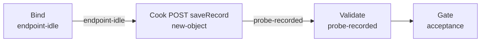

# xiaoshan-weighbridge（govsync）

## 目的 / Goal

萧山地磅称重上报 demo：`POST /sapi/v1/inoutRecord/lantu/saveRecord`，`buildLicenseNo` 为原值 `L`，**不上报心跳**。

Goal 槽：`gov-xiaoshan-weighbridge-save`

Status: **active**

路径：`pipelines/graphs/govsync/xiaoshan-weighbridge/`（见 [`pipelines/AGENTS.md`](../../../AGENTS.md)）

若替换旧验法：retired ← `graphs/_retired/2026-08/postweight/`（单一 `inoutRecord/save` 混用报文）

## 非目标

- 不修改 `repos/` 业务代码
- 不提交 secrets / runs
- 不替代 OpenSpec 与 CI
- Agent 不宣布 L3 通过
- **不做** `/sapi/sysdevicemng/heatBeat`

## 配置指针

- `./config.yaml`
- `./secrets.local.yaml`（gitignore）
- `./secrets.example.yaml`
- 夹具：`./fixtures/test_pic.jpg`
- 设计：`docs/2026-08-27-xiaoshan-weighbridge-gate-product-upload-design/01-设计稿.md`

## Sockets

| | |
|--|--|
| Start | `endpoint-idle` |
| End | `probe-recorded` |
| Cook | `new-object` |

## Context

- **指针**：`target.url` = `http://191.12.15.58:8899/sapi/v1/inoutRecord/lantu/saveRecord`（沿用既有联调基址；SyncDoc 示例主机不同，见设计稿 Q5）
- **指纹**：必填 `dataSource`、`inOutType`、`goodsWeight`；**不得**写入卡口字段 `deviceID` / `siteType` / `areaCode`
- **场景**：对接码 `XNXS20250819001`；车牌 `浙A12345`；`dataSource=WEIGHBRIDGE_XIAOSHAN`
- **时间**：`snapTimeMode: run-now`
- **歧义**：停止并问用户

## 状态机 / Cook chain



1. **bind-endpoint** — 解析 URL、夹具、`scenario.channel=weighbridge`
2. **cook-post** — 地磅 JSON（含 `dataSource`）；POST
3. **validate-response** — HTTP + `code`/`msg`；L0–L2；不宣布 L3

失败策略：`retries: 2`；`stopOnError: true`。

## 证据包

相对本次 `runs/<yyyy-MM-ddTHHmmss>/`：

| collector | required | sink |
|-----------|----------|------|
| request-response | true | `http/` |
| summary | true | `summary.json` |
| report | true | `report.md` |
| acceptance 副本 | true | `acceptance.md` |

`snapImages` 证据只保留 count / 字节长度。

## Invoke

- 命令：`/run-pipeline govsync/xiaoshan-weighbridge`
- 脚本（**experimental**）：

```powershell
powershell -ExecutionPolicy Bypass -File pipelines/graphs/govsync/xiaoshan-weighbridge/scripts/Invoke-XiaoshanUpload.ps1
```

## 人闸 / Gate

- `environment: shared` 确认
- **破坏性确认**：POST 会向政府平台写入称重记录
- 最终验收：用户 `pass` / `fail`

## 判定级别

| 级 | 谁判 |
|----|------|
| L0 可达 | Agent |
| L1 非空壳 | Agent 提示 |
| L2 契约可见 | Agent 提示（code==200） |
| L3 业务正确 | **用户** |

## Handoff

Output socket：`probe-recorded`。姊妹 Graph：`xiaoshan-gate`、`xiaoshan-product`。
