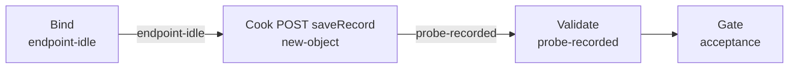

# xnxs20240725003-weighbridge（govsync）

## 目的 / Goal

针对接入码 **`XNXS20240725003`** 的萧山地磅称重上报联调：`POST /sapi/v1/inoutRecord/lantu/saveRecord`。  
场景取自 `assets/XNXS20240725003数据推送测试/`（车牌 `浙A12345`，重量 `1385kg`，抓拍图 PNG）。

Goal 槽：`gov-xnxs20240725003-weighbridge-save`（与通用 `xiaoshan-weighbridge` / `gov-xiaoshan-weighbridge-save` **互不替代**）

Status: **active**

路径：`pipelines/graphs/govsync/xnxs20240725003-weighbridge/`（见 [`pipelines/AGENTS.md`](../../../AGENTS.md)）

## 非目标

- 不修改 `repos/` 业务代码
- 不提交 secrets / runs
- 不替代 OpenSpec 与 CI
- Agent 不宣布 L3 通过
- **不做** `/sapi/sysdevicemng/heatBeat`
- 不退役通用 `xiaoshan-weighbridge` Graph

## 配置指针

- `./config.yaml`
- `./secrets.local.yaml`（gitignore）
- `./secrets.example.yaml`
- 资产源：`assets/XNXS20240725003数据推送测试/`
- 夹具：`./fixtures/b94c5e7e31e77b9eb42ec009e8deeb49.png`（由复制脚本从 assets 同步）
- 设计：`docs/2026-08-27-xiaoshan-weighbridge-gate-product-upload-design/01-设计稿.md`

## Sockets

| | |
|--|--|
| Start | `endpoint-idle` |
| End | `probe-recorded` |
| Cook | `new-object` |

## Context

- **指针**：`target.url` = `http://191.12.15.58:8899/sapi/v1/inoutRecord/lantu/saveRecord`
- **指纹**：`buildLicenseNo=XNXS20240725003`、`goodsWeight=1385`、`carNo=浙A12345`；必填 `dataSource`、`inOutType`；**不得**写入卡口字段 `deviceID` / `siteType` / `areaCode`
- **场景**：对接码 `XNXS20240725003`；`dataSource=WEIGHBRIDGE_XIAOSHAN`
- **时间**：`snapTimeMode: run-now`
- **歧义**：停止并问用户

## 状态机 / Cook chain



1. **bind-endpoint** — 解析 URL、fixtures、`scenario.channel=weighbridge`
2. **cook-post** — 地磅 JSON（含 `dataSource`）；POST
3. **validate-response** — HTTP + `code`/`msg`；L0–L2；不宣布 L3

失败策略：`retries: 2`；`stopOnError: true`。

## 证据包

相对本次 `runs/<yyyy-MM-ddTHHmmss>/`：

| collector | required | sink |
|-----------|----------|------|
| request-response | true | `http/` |
| summary | true | `summary.json` |
| report | true | `report.md` |
| acceptance 副本 | true | `acceptance.md` |

`snapImages` 证据只保留 count / 字节长度。

## Invoke

- 命令：`/run-pipeline govsync/xnxs20240725003-weighbridge`
- 脚本（**experimental**）：

```powershell
# 从 assets 同步夹具，并打出可拷贝到内网的便携包
powershell -ExecutionPolicy Bypass -File `
  pipelines/graphs/govsync/xnxs20240725003-weighbridge/scripts/Copy-XnxsWeighbridgePackage.ps1

# Graph 内 cook
powershell -ExecutionPolicy Bypass -File `
  pipelines/graphs/govsync/xnxs20240725003-weighbridge/scripts/Invoke-XnxsWeighbridge.ps1
```

便携包目录默认：`_tmp/xnxs20240725003-weighbridge-package/`（含 `Run-XnxsWeighbridge.cmd` / `.ps1` / 抓拍图）。

## 人闸 / Gate

- `environment: shared` 确认
- **破坏性确认**：POST 会向政府平台写入称重记录
- 最终验收：用户 `pass` / `fail`

## 判定级别

| 级 | 谁判 |
|----|------|
| L0 可达 | Agent |
| L1 非空壳 | Agent 提示 |
| L2 契约可见 | Agent 提示（code==200） |
| L3 业务正确 | **用户** |

## Handoff

Output socket：`probe-recorded`。姊妹 Graph：`xiaoshan-weighbridge`（通用 demo）、`xiaoshan-gate`、`xiaoshan-product`。
