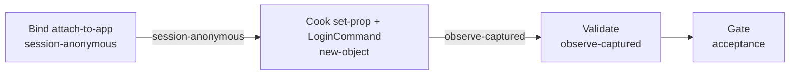

# login-devtools（materialclient）

## 目的 / Goal

用 **Avalonia DevTools MCP**（`avalonia_devtools`）对**已运行**的 MaterialClient 主程序 `LoginWindow` 做白盒登录：attach → 写 `Username`/`Password` → 触发 `LoginCommand` → 采证 tree/props/截图，证明登录表面可达且 `IsLoginSuccessful`（或等价主窗出现）。

Goal 槽：`login-observe-devtools`

Status: **active**

路径：`pipelines/graphs/materialclient/login-devtools/`（见 [`pipelines/AGENTS.md`](../../../AGENTS.md)）

若替换旧验法：retired ← （无）

## 非目标

- 不修改 `repos/` 业务代码
- 不提交 secrets / runs
- 不替代 OpenSpec 与 CI
- Agent 不宣布 L3 通过
- 不覆盖 FlaUI 黑盒路径（见 `materialclient/login-flaui`）
- **禁止**用 `attach-to-file` 预览冒充真登录成功（Design DataContext 无平台鉴权）

## 配置指针

- `./config.yaml`
- `./secrets.local.yaml`（gitignore）
- `./secrets.example.yaml`
- `./design-brief.md`

## Sockets

| | |
|--|--|
| Start | `session-anonymous` |
| End | `observe-captured` |
| Cook | `new-object`（每次 `runs/<ts>/` 证据包） |

## Context

- **指针**：
  - View：`repos/MaterialClient/src/MaterialClient.UI/Views/LoginWindow.axaml`
  - VM：`LoginWindowViewModel`（`Username` / `Password` / `LoginCommand` / `IsLoginSuccessful` / `ErrorMessage`）
  - 启动：`StartupService.ShowLoginWindowAsync`
  - Attach：`attach-to-app`（进程列表由 MCP 返回；不编造 PID）
- **指纹**：`IsLoginSuccessful=true` 或 LoginWindow 隐藏 + 主称重窗可见；`ErrorMessage` 空
- **显示名**：仅人读
- **前置**：主程序已跑且 LoginWindow 可见；授权有效；无活跃会话
- **歧义**：停并问用户

## 状态机 / Cook chain

编号步骤（与 `config.yaml` 1:1）：

1. **bind-app** — 读 secrets；`attach-to-app`；`search`/`tree` 定位 LoginWindow；先挂钩 collector。若只有授权窗或未运行 → 人闸。
2. **cook-login** — `set-prop` Username/Password（证据中脱敏）；`action` 触发 `LoginCommand`（或等价）；等待 `IsLoggingIn` 结束。
3. **validate-surface** — 读 `IsLoginSuccessful` / `ErrorMessage`；`screenshot`；对照 expect；写 summary/report。

失败策略：`retries: 2`；`stopOnError: false`。

## 证据包

相对本次 `runs/<yyyy-MM-ddTHHmmss>/`：

| collector | required | sink |
|-----------|----------|------|
| screenshot | true | `screenshots/pre-login.png`、`screenshots/post-login.png` |
| tree-snapshot | true | `tree/pre-login.txt`、`tree/post-login.txt` |
| props | true | `props/`（**禁止**落 Password 明文） |
| logs | true | `logs/`（不可得 → missing） |
| http | true | `http/`（默认 missing / count 0） |
| summary | true | `summary.json` |
| report | true | `report.md` |
| acceptance 副本 | true | `acceptance.md`（pending） |

缺证仍写文件：`source: missing` / `count: 0`。

## Invoke

- 命令：`/run-pipeline materialclient/login-devtools`
- 或：`/run-observe-pipeline materialclient/login-devtools`
- MCP：`avalonia_devtools`
- 脚本：无

## 人闸 / Gate

- 缺 secrets
- 应用未运行 / 非 LoginWindow / AuthCode 阻塞
- 最终验收：用户 `pass` / `fail`

## 判定级别

| 级 | 谁判 |
|----|------|
| L0 attach 成功 | Agent |
| L1 凭据已写入并触发 | Agent 提示 |
| L2 成功标志或主窗 | Agent 提示 |
| L3 业务正确 | **用户** |

## Handoff

Output socket：`observe-captured`。与 `login-flaui` Goal 互斥独立；可对照两套证据，勿合并为同一 slug。
