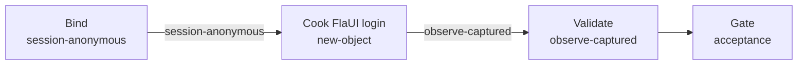

# login-flaui（materialclient）

## 目的 / Goal

用 **FlaUI-MCP**（Cursor MCP `windows`）对 MaterialClient **主程序** `LoginWindow` 做黑盒登录：填账号密码 → 点「立即登录」→ 采证 UIA 树与截图，证明登录表面可达且离开登录壳。

Goal 槽：`login-observe-flaui`

Status: **active**

路径：`pipelines/graphs/materialclient/login-flaui/`（见 [`pipelines/AGENTS.md`](../../../AGENTS.md)）

若替换旧验法：retired ← （无）

## 非目标

- 不修改 `repos/` 业务代码
- 不提交 secrets / runs
- 不替代 OpenSpec 与 CI
- Agent 不宣布 L3 通过
- 不覆盖 DevTools 白盒路径（见 `materialclient/login-devtools`）
- 不验证 `MaterialClient.Urban` 启动授权链（本 Graph 指针为主程序 `StartupService` + `LoginWindow`）

## 配置指针

- `./config.yaml`
- `./secrets.local.yaml`（gitignore；含 username / password / 可选 exePath）
- `./secrets.example.yaml`
- `./design-brief.md`

## Sockets

| | |
|--|--|
| Start | `session-anonymous` |
| End | `observe-captured` |
| Cook | `new-object`（每次 `runs/<ts>/` 证据包） |

## Context

- **指针**：
  - View：`repos/MaterialClient/src/MaterialClient.UI/Views/LoginWindow.axaml`
  - VM：`MaterialClient.UI.ViewModels.LoginWindowViewModel`
  - 启动：`repos/MaterialClient/src/MaterialClient/Services/StartupService.cs`（`ShowLoginWindowAsync`）
  - 窗体 Title：`凡东智能物料验收系统`
  - 控件：`UsernameTextBox` / `PasswordTextBox` / Content=`立即登录`
- **指纹**：提交后 LoginWindow 隐藏；有人值守主窗可见；无持续 `ErrorMessage`
- **显示名**：仅人读，禁止当唯一键
- **前置**：授权有效（否则 `AuthCodeWindow` → 本 Graph **人闸停**）；无活跃会话（否则不显示 LoginWindow）
- **歧义**：停并问用户（例如误跑 Urban exe、窗口 Title 变更）

## 状态机 / Cook chain

编号步骤（与 `config.yaml` 1:1）：

1. **bind-session** — 读 `secrets.local.yaml`；`windows_list_windows` / `windows_snapshot` 确认 LoginWindow；若见授权窗则停。必要时 `windows_launch`（`exePath`）。先挂钩 collector。
2. **cook-login** — `windows_fill` 账号/密码 → `windows_click`「立即登录」→ 等待加载结束（约数秒）。
3. **validate-surface** — 再 snapshot + screenshot；对照 `expect` L0–L2；写 `summary.json` / `report.md`，状态=等待验收。

失败策略：`retries: 2`；`stopOnError: false`。

## 证据包

相对本次 `runs/<yyyy-MM-ddTHHmmss>/`：

| collector | required | sink |
|-----------|----------|------|
| screenshot | true | `screenshots/pre-login.png`、`screenshots/post-login.png` |
| uia-snapshot | true | `uia/pre-login.txt`、`uia/post-login.txt` |
| logs | true | `logs/`（不可得则 `source: missing`） |
| http | true | `http/`（桌面默认难截获 → `count: 0` / missing） |
| summary | true | `summary.json` |
| report | true | `report.md` |
| acceptance 副本 | true | `acceptance.md`（pending） |

缺证仍写文件：`source: missing` / `count: 0`。**禁止**把密码写入证据正文。

## Invoke

- 命令：`/run-pipeline materialclient/login-flaui`
- 或：`/run-observe-pipeline materialclient/login-flaui`
- MCP：`windows`（FlaUI-MCP）
- 脚本：无（experimental 未引入）

## 人闸 / Gate

- 缺 `secrets.local.yaml` 或 username/password
- 启动落到 `AuthCodeWindow` / 已登录无 LoginWindow
- 最终验收：用户 `pass` / `fail`

## 判定级别

| 级 | 谁判 |
|----|------|
| L0 可达 | Agent（窗体 + 控件） |
| L1 已提交 | Agent 提示 |
| L2 离开登录壳 | Agent 提示 |
| L3 业务正确 | **用户** |

## Handoff

Output socket：`observe-captured`。下游若要接「登录后列表非空壳」须另开 observe Goal，勿塞进本 slug。
