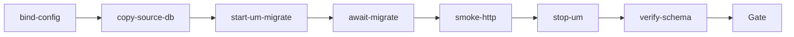

# urban-db-accesscode-migrate（urban）

## 目的 / Goal

用线上快照 `_tmp/UrbanManagement.db` 的**本地工作副本**验证：挂载当前 UrbanManagement 代码后，EF `MigrateAsync` 能否跑通（含 `BuildLicenseNo`→`AccessCode`），且 Web 能启动并对称重列表做冒烟。

Goal 槽：`urban-sqlite-accesscode-migrate-verify`

Status: **active**

路径：`pipelines/graphs/urban/urban-db-accesscode-migrate/`（见 [`pipelines/AGENTS.md`](../../../AGENTS.md)）

OpenSpec：`openspec/changes/rename-urban-entity-buildlicenseno-to-accesscode/`

## 非目标

- **不写回** `_tmp/UrbanManagement.db` 原件，不碰生产机
- 不修改 `repos/` 业务代码 / migration 来「让图变绿」
- 不提交 secrets / runs
- 不替代 OpenSpec 与 CI
- Agent 不宣布 L3 通过
- 不测萧山出站 / LPR / MaterialClient

## 配置指针

- `./config.yaml`
- `./secrets.local.yaml`（gitignore；可覆盖 `sourceDb` / `baseUrl`）
- `./secrets.example.yaml`

## 前置 / 基线（生成时扫表）

线上快照相对当前代码**落后多步 migration**（仅 3 条已应用），且**无** `UrbanPassageRecords` 表。本图会依次应用 pending（含建表 + 最终 `RenameEntityBuildLicenseNoToAccessCode`）。若中间 migration 因真实数据失败，图应**红灯采证**，不得改业务仓掩盖。

| 表 | 基线列（接入码） |
|----|------------------|
| `UrbanWeighingRecords` | `BuildLicenseNo` 存在，`AccessCode` 不存在 |
| `GovSyncData` | 同上 |
| `UrbanPassageRecords` | 表不存在 |
| `GovProjects` | 已是 `AccessCode` |

## Sockets

| | |
|--|--|
| Start | `sqlite-prod-snapshot` |
| End | `migrate-use-proved` |
| Cook | `new-object` |

## Cook chain



1. **bind-config** — 读 config/secrets；建 `runs/<ts>/`
2. **copy-source-db** — 复制原件 → `working/`；`verify-schema.mjs --mode pre`
3. **start-um-migrate** — `dotnet build` + 启动 App，`ConnectionStrings__Default` 指向工作副本；关闭出站轮询
4. **await-migrate** — 等 HTTP；日志须含 migrate 成功句（失败句则 L0 fail）
5. **smoke-http** — `GET /`、`GET /api/app/urban-weighing-record?...`
6. **stop-um** — 结束本图拉起的进程（解锁 SQLite）
7. **verify-schema** — post 列/行数/历史 migration；写 summary / report

## 证据包

| collector | sink |
|-----------|------|
| prepare | `runs/<ts>/prepare/` |
| logs | `runs/<ts>/logs/` |
| schema | `runs/<ts>/schema/pre-schema.json` · `post-schema.json` |
| HTTP | `runs/<ts>/http/` |
| summary | `runs/<ts>/summary.json` |
| report | `runs/<ts>/report.md` |

## 判定级别

| 级 | 内容 | 谁判 |
|----|------|------|
| L0 | 副本就绪；App 启动且 migrate 成功日志 | Agent |
| L1 | 三流水表列为 `AccessCode`；称重行数未丢 | Agent |
| L2 | 历史含 rename migration；weighing list HTTP 可达 | Agent |
| L3 | Blazor 称重列表业务可读 | **用户** |

## Invoke

```powershell
powershell -ExecutionPolicy Bypass -File `
  pipelines/graphs/urban/urban-db-accesscode-migrate/scripts/Invoke-UrbanDbAccessCodeMigrate.ps1
```

或：`/run-pipeline urban/urban-db-accesscode-migrate`

脚本标 **experimental**。默认人闸需输入 `YES`（确认只改本地副本）。

## 人闸 / Gate

- 缺 `sourceDb`
- 确认只写 `runs/<ts>/working/`，不覆盖原件
- 最终验收：用户 `pass` / `fail`

## Handoff

Output socket：`migrate-use-proved`。下游若要接，须声明对齐该态。
