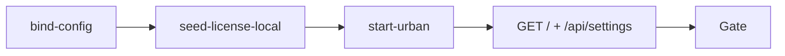

# urban-license-probe（urban）

## 目的 / Goal

验证 **MaterialClient.Urban** 在 pipeline **Local license seed**（`Invoke-UrbanLicenseSeed` + Node/TS `upsert-license-info`）后，诊断口可达且启动授权通过。

Goal 槽：`urban-license-seed-probe`

Status: **active**

继任：`graphs/_retired/2026-09/urban-debug-license-bypass/`（已退役；原 Debug 旁路验法）

路径：`pipelines/graphs/urban/urban-license-probe/`（见 [`pipelines/AGENTS.md`](../../../AGENTS.md)）

## 非目标

- 不修改 `repos/` 业务代码
- 不提交 secrets / runs
- 不替代 OpenSpec 与 CI
- Agent 不宣布 L3 通过
- 不测 LPR / test-passage（见 `urban-passage-probe`）

## 配置指针

- `./config.yaml`
- `./secrets.local.yaml`（gitignore；可选覆盖 `baseUrl`）
- `./secrets.example.yaml`
- 共享 seed：`pipelines/_shared/urban/seeds/demo-license.json`
- 共享授权：`pipelines/_shared/urban/Invoke-UrbanLicenseSeed.ps1`
- upsert 工具：`pipelines/_shared/urban/tools/upsert-license-info/upsert-license-info.ts`
- OpenSpec：`openspec/changes/update-urban-debug-license-bypass/`

## 前置

1. **Node.js 22.5+** 与 `pipelines/pnpm install`（首次 Local seed 会安装依赖）
2. **启动并探测**（一键）：
   ```powershell
   powershell -ExecutionPolicy Bypass -File `
     pipelines/graphs/urban/urban-license-probe/scripts/Invoke-UrbanLicenseProbe.ps1
   ```
3. **分步**：
   ```powershell
   # 构建 + seed + 启动
   powershell -ExecutionPolicy Bypass -File `
     pipelines/graphs/urban/urban-license-probe/scripts/Start-UrbanForLicenseProbe.ps1

   # Urban 已运行时仅 HTTP 探测
   powershell -ExecutionPolicy Bypass -File `
     pipelines/graphs/urban/urban-license-probe/scripts/Invoke-UrbanLicenseProbe.ps1 -SkipStart -SkipConfirm
   ```
4. 切换项目 seed：启动时传 `-SeedRelPath seeds/<project>-license.json`（路径相对 `_shared/urban/`）
5. 跳过 seed（仅已灌数场景）：`-SkipSeed`

## Sockets

| | |
|--|--|
| Start | `urban-license-idle` |
| End | `license-proved` |
| Cook | `new-object` |

## Cook chain



1. **bind-config** — 读 config/secrets；建 `runs/<ts>/`
2. **seed-license-local** — `Invoke-UrbanLicenseSeed -Mode Local`（写 `license.urban` + upsert `LicenseInfo`）
3. **start-urban** — 启动 Urban（`MinimalWebHost__EnableOnStartup=true`）
4. **cook-probe-host** — `GET /`、`GET /api/settings` 采证
5. **validate-seed** — L2：`license.urban` 存在且 seed 未跳过

## 证据包

| collector | sink |
|-----------|------|
| HTTP | `runs/<ts>/http/` |
| prepare | `runs/<ts>/prepare/license-seed.json` |
| summary | `runs/<ts>/summary.json` |
| report | `runs/<ts>/report.md` |

## 判定级别

| 级 | 内容 | 谁判 |
|----|------|------|
| L0 | `GET /` → 200 | Agent |
| L1 | `GET /api/settings` → 200 | Agent |
| L2 | Local seed 已执行且 `license.urban` 存在 | Agent |
| L3 | 主窗口可用、无未授权弹窗 | **用户** |

## Invoke

```powershell
powershell -ExecutionPolicy Bypass -File `
  pipelines/graphs/urban/urban-license-probe/scripts/Invoke-UrbanLicenseProbe.ps1
```

脚本（**experimental**）：`scripts/Invoke-UrbanLicenseProbe.ps1`、`scripts/Start-UrbanForLicenseProbe.ps1`
