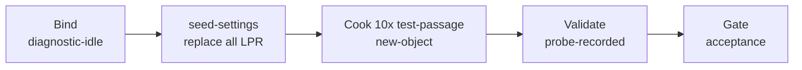

# urban-passage-probe（urban）

## 目的 / Goal

对 **MaterialClient.Urban** 本地诊断口，经 `LicensePlateRecognizedEventData` 链路注入 **卡口（Checkpoint）** 与 **成品（FinishedProduct）** 进出记录，共 **10 条** 用例；抓拍图统一使用共享夹具 `govsync/xiaoshan-gate/fixtures/test_pic.jpg`（图中车牌 **浙A12345** 黄牌）。

Goal 槽：`urban-passage-lpr-probe`

Status: **active**

路径：`pipelines/graphs/urban/urban-passage-probe/`（见 [`pipelines/AGENTS.md`](../../../AGENTS.md)）

## 非目标

- 不修改 `repos/` 业务代码
- 不提交 secrets / runs
- 不替代 OpenSpec 与 CI
- Agent 不宣布 L3 通过
- 不探测 UM / 萧山政府平台（见 `govsync/xiaoshan-gate`）

## 配置指针

- `./config.yaml`
- `./seeds/passage-cases.json`（10 条用例）
- `./seeds/lpr-devices.json`（LPR 全量替换种子，4 台）
- `./secrets.local.yaml`（gitignore；可选覆盖 `baseUrl`）
- `./secrets.example.yaml`
- 共享 seed：`pipelines/_shared/urban/Invoke-UrbanLprSeedSettings.ps1`
- 共享授权：`pipelines/_shared/urban/Invoke-UrbanLicenseSeed.ps1`、`seeds/demo-license.json`
- 夹具：`../../govsync/xiaoshan-gate/fixtures/test_pic.jpg`
- 调研：`docs/2026-08-31-forge-hikvision-lpr-without-device/`

## 前置

1. **（推荐）启动前写入演示授权**，避免未授权阻塞诊断口：
   ```powershell
   . pipelines/_shared/urban/Invoke-UrbanLicenseSeed.ps1
   Invoke-UrbanLicenseSeed -Mode Local -UrbanAppDir "<MaterialClient.Urban 输出目录>" -SkipConfirm
   ```
   固定种子：`pipelines/_shared/urban/seeds/demo-license.json`。JWT 内 `machineCode` 须与本机一致，否则启动仍会失败。
2. 启动 **MaterialClient.Urban**（非主程序 exe）
3. `appsettings.json` → `MinimalWebHost:EnableOnStartup=true`，默认 `http://localhost:9961`
4. **seed-settings 会完全覆盖** 当前所有 LPR 配置为 `seeds/lpr-devices.json` 中的 4 行（其它 Settings 块保留 GET 结果）

## Sockets

| | |
|--|--|
| Start | `diagnostic-idle` |
| End | `probe-recorded` |
| Cook | `new-object` |

## 10 条用例（seeds/passage-cases.json）

| # | id | siteType | device | plate |
|---|-----|----------|--------|-------|
| 1 | cp-01-gate-in-primary | Checkpoint | gate-in | 浙A12345 |
| 2 | cp-02-gate-out-same-plate | Checkpoint | gate-out | 浙A12345 |
| 3 | cp-03-gate-in-blue-car | Checkpoint | gate-in | 浙B88888 |
| 4 | cp-04-gate-in-medium | Checkpoint | gate-in | 浙C66666 |
| 5 | cp-05-gate-out-exit | Checkpoint | gate-out | 浙D77777 |
| 6 | fp-01-product-in-primary | FinishedProduct | product-in | 浙A12345 |
| 7 | fp-02-product-out-exit | FinishedProduct | product-out | 浙A54321 |
| 8 | fp-03-product-in-nev | FinishedProduct | product-in | 浙E11111 |
| 9 | fp-04-product-out-heavy | FinishedProduct | product-out | 浙F22222 |
| 10 | fp-05-product-in-repeat | FinishedProduct | product-in | 浙G33333 |

每条 POST `/api/lpr/test-passage`，`lprImagePath` 指向上述 `test_pic.jpg` 绝对路径。

## 状态机 / Cook chain



1. **bind-diagnostic** — 读 config/secrets；确认夹具存在
2. **seed-settings** — 共享脚本 **完全替换** `licensePlateRecognitionConfigs`；POST 整份 Settings
3. **cook-passage-cases** — 逐条 POST `/api/lpr/test-passage`
4. **validate-responses** — 汇总 `success=true`；写 `summary.json` / `report.md`

## 证据包

相对 `runs/<yyyy-MM-ddTHHmmss>/`：

| collector | sink |
|-----------|------|
| settings | `http/01-settings-get.json`, `http/02-settings-save.json`, `seed-summary.json` |
| cases | `http/NN-<case-id>.request.json`, `.response.json` |
| summary | `summary.json` |
| report | `report.md` |

## Invoke

仅 seed-settings（覆盖全部 LPR 配置）：

```powershell
powershell -ExecutionPolicy Bypass -File `
  pipelines/graphs/urban/urban-passage-probe/scripts/Invoke-SeedSettings.ps1
```

启动前 seed 演示授权（本地 `license.urban` + SQLite）：

```powershell
powershell -ExecutionPolicy Bypass -File `
  pipelines/graphs/urban/urban-passage-probe/scripts/Invoke-SeedLicense.ps1 `
  -UrbanAppDir "<MaterialClient.Urban 输出目录>" -SkipConfirm
```

完整 probe（先 seed-settings，再 10 条 test-passage）：

```powershell
powershell -ExecutionPolicy Bypass -File `
  pipelines/graphs/urban/urban-passage-probe/scripts/Invoke-UrbanPassageProbe.ps1
```

或：`/run-probe-pipeline urban/urban-passage-probe`

## 人闸 / Gate

- Urban 未启动 / 诊断口不可达
- seed-settings 会 **删除现有全部 LPR 行**，仅保留种子文件中的设备
- L3：用户在 UI 确认卡口/成品 tab 有记录

## 判定级别

| 级 | 谁判 |
|----|------|
| L0 | Agent — 诊断 Host 可达 |
| L1 | Agent — LPR 全量替换保存成功 |
| L2 | Agent — 10 条 test-passage 均 `success=true` |
| L3 | **用户** — UI 列表可见且业务可接受 |
