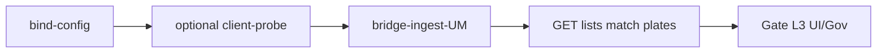

# urban-passage-um-reconcile（urban）

## 目的 / Goal

**MaterialClient.Urban ↔ UrbanManagement** 进出上云联调：在 OpenSpec `add-urbanmanagement-passage-xiaoshan-upload` 语境下，验证客户端 seed 用例与服务端 **独立 Receive / 列表 API** 对齐；并为后续 **客户端 native 上云**（tasks 7.1–7.2）预留 reconcile 槽。

Goal 槽：`urban-passage-client-um-reconcile`

Status: **active**

路径：`pipelines/graphs/urban/urban-passage-um-reconcile/`

## 非目标

- 不修改 `repos/` 业务代码
- 不替代 OpenSpec / CI
- Agent 不宣布 L3 通过
- **不**在本 Graph 内直接 POST 萧山 Gov（见 `govsync/xiaoshan-gate`、`xiaoshan-product`）
- 不宣称客户端 `SubmitRecordAsync` passage 分叉已实现（tasks 7.x 未完成前用 **Bridge** 模式）

## 架构与数据流

```text
┌─────────────────────┐     ingest (Bridge / 未来 client-upload)     ┌──────────────────────┐
│ MaterialClient.Urban │ ───────────────────────────────────────────► │ UrbanManagement      │
│ UrbanPassageRecord   │   POST /api/app/urban-*-passage/receive      │ UrbanPassageRecord   │
│ (本地 SQLite)        │   + /api/urban-attachment/upload-multipart   │ (SQL Server)         │
└──────────┬──────────┘                                              └──────────┬───────────┘
           │ urban-passage-probe                                              │ GovSync Worker
           │ POST /api/lpr/test-passage                                       ▼
           │ (仅客户端)                                              govsync 三通道（人工 follow-up）
```

| 阶段 | 客户端 | 服务端 UM | 本 Graph 模式 |
|------|--------|-----------|---------------|
| A. 本地灌数 | `urban-passage-probe` 10 条 | — | `-IncludeClientProbe` |
| B. 上云（当前） | — | Receive API | **Bridge**（脚本代发 Receive） |
| B′. 上云（目标） | Polling + SubmitRecordAsync | Receive API | **client-upload**（tasks 7.x 后） |
| C. 对照 | 本地 tab / SQLite | GET list + Blazor 页 | **ReconcileOnly** 或 Bridge 后自动 GET |
| D. 出站 Gov | 禁止直连 | Worker → 萧山 | 人工 + `govsync/*` probe |

## 配置指针

- `./config.yaml`
- `./secrets.local.yaml`（`umBaseUrl`、`proId`、`buildLicenseNo`、可选 `authorization`）
- `./secrets.example.yaml`
- 共享 seed：`../urban-passage-probe/seeds/passage-cases.json`、`lpr-devices.json`
- 夹具：`../../govsync/xiaoshan-gate/fixtures/test_pic.jpg`
- OpenSpec：`openspec/changes/add-urbanmanagement-passage-xiaoshan-upload/`
- 调研：`docs/2026-08-28-urbanmanagement-passage-xiaoshan-upload/`

### UM API（联调关注）

| 用途 | 方法 | 路径 |
|------|------|------|
| 卡口 ingest | POST | `/api/app/urban-checkpoint-passage/receive` |
| 成品 ingest | POST | `/api/app/urban-finished-product-passage/receive` |
| 卡口列表 | GET | `/api/app/urban-checkpoint-passage?MaxResultCount=100` |
| 成品列表 | GET | `/api/app/urban-finished-product-passage?MaxResultCount=100` |
| 附件 | POST | `/api/urban-attachment/upload-multipart` |

Blazor：`/checkpoint-passage`、`/finished-product-passage`

## 前置

1. **UrbanManagement** 本地运行（默认 `https://localhost:44300` 或 `secrets.local.yaml` 的 `umBaseUrl`）
2. **OpenSpec UM 侧 tasks 2–6** 已落地（实体、Receive、页面、Gov Worker）
3. **Bridge 模式** 不要求 MaterialClient 运行；**含客户端探针** 时需：
   - `urban-license-probe` 或 `Start-UrbanForProbe` 已 seed 授权
   - `MinimalWebHost__EnableOnStartup=true`
4. `proId` / `buildLicenseNo` 与演示项目一致（默认来自 `demo-license.json` / UM 配置）
5. **MaterialClient tasks 7.1–7.2 未完成**：native client-upload 联调见下文「演进路径」

## 联调步骤（推荐顺序）

### 步骤 1 — 仅 UM Bridge（最快）

不启动客户端，直接用 seed 10 条 POST UM Receive，再 GET 列表对照车牌：

```powershell
powershell -ExecutionPolicy Bypass -File `
  pipelines/graphs/urban/urban-passage-um-reconcile/scripts/Invoke-UrbanPassageUmReconcile.ps1 `
  -Mode Bridge -SkipConfirm
```

期望：卡口列表含 5 个 seed 车牌，成品列表含 5 个 seed 车牌。

### 步骤 2 — 客户端 + UM 双侧

先跑客户端 probe 写本地 SQLite，再 Bridge 上云（模拟「客户端已有数据、UM 侧 ingest」）：

```powershell
powershell -ExecutionPolicy Bypass -File `
  pipelines/graphs/urban/urban-passage-um-reconcile/scripts/Invoke-UrbanPassageUmReconcile.ps1 `
  -Mode Bridge -IncludeClientProbe -SkipConfirm
```

人工 L3：对比 MaterialClient 卡口/成品 tab 与 UM Blazor 两页。

### 步骤 3 — 仅对照（不 POST）

UM 已有数据时：

```powershell
powershell -ExecutionPolicy Bypass -File `
  pipelines/graphs/urban/urban-passage-um-reconcile/scripts/Invoke-UrbanPassageUmReconcile.ps1 `
  -Mode ReconcileOnly -SkipConfirm
```

### 步骤 4 — Gov 出站（可选，人工）

1. UM `StorageOptions:GovAddress` / `GovSiteAddress` 指向联调 Gov 或 mock
2. 启用 `BackgroundServices:Polling` 或 `BasePlatformSync:Enabled`
3. 分别 cook：
   - `pipelines/graphs/govsync/xiaoshan-gate/`（卡口 `buildLicenseNo=L`）
   - `pipelines/graphs/govsync/xiaoshan-product/`（成品 `L-02`）

## Sockets

| | |
|--|--|
| Start | `client-um-idle` |
| End | `client-um-aligned` |
| Cook | `new-object` |

## Cook chain



## 证据包

| collector | sink |
|-----------|------|
| HTTP | `runs/<ts>/http/`（receive + list） |
| reconcile | `runs/<ts>/reconcile/plate-match.json` |
| client-probe | `runs/<ts>/client-probe/`（`-IncludeClientProbe` 时） |
| summary / report | `summary.json`、`report.md` |

## 判定级别

| 级 | 内容 | 谁判 |
|----|------|------|
| L0 | UM list API 可达 | Agent |
| L1 | Bridge：10 条 receive 均返回 `recordId` | Agent |
| L2 | 卡口/成品列表包含 seed 期望的 5+5 车牌 | Agent |
| L3 | Blazor 两页可见；可选 Gov 出站正确 | **用户** |

## 演进路径（OpenSpec tasks 7.x 后）

| 模式 | 触发条件 | 变更 |
|------|----------|------|
| `client-upload` | MC `SubmitRecordAsync` passage 分叉 + 附件 sync | 去掉 Bridge POST；reconcile 读客户端 pending/sync 状态 |
| 附件 | tasks 7.1 | Bridge 脚本上传 `upload-multipart` 并填 `attachmentIds` |

## Invoke

```powershell
powershell -ExecutionPolicy Bypass -File `
  pipelines/graphs/urban/urban-passage-um-reconcile/scripts/Invoke-UrbanPassageUmReconcile.ps1
```

脚本（**experimental**）：`scripts/Invoke-UrbanPassageUmReconcile.ps1`

## 人闸

- UM 未启动 / URL 错误
- `proId` 与 UM 项目配置不一致
- Bridge 会写入 UM 数据库（非 dryRun）
- L3 UI / Gov 仅用户
