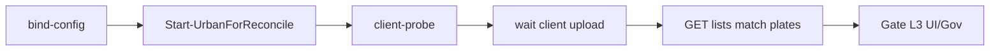

# urban-passage-um-reconcile（urban）

## 目的 / Goal

**MaterialClient.Urban ↔ UrbanManagement** 进出上云联调：在 OpenSpec `add-urbanmanagement-passage-xiaoshan-upload` 语境下，验证客户端 seed 用例与服务端 **独立 Receive / 列表 API** 对齐；并为后续 **客户端 native 上云**（tasks 7.1–7.2）预留 reconcile 槽。

Goal 槽：`urban-passage-client-um-reconcile`

Status: **active**（ClientUpload cook L0–L2 已于 `runs/2026-09-01T163853` 通过）

路径：`pipelines/graphs/urban/urban-passage-um-reconcile/`

## 非目标

- 不修改 `repos/` 业务代码
- 不替代 OpenSpec / CI
- Agent 不宣布 L3 通过
- **不**在本 Graph 内直接 POST 萧山 Gov（见 `govsync/xiaoshan-gate`、`xiaoshan-product`）
- 客户端 **`IUrbanPassageUploadService`** 经 `UrbanManagement:BaseUrl` 上云（见 `update-urban-passage-client-upload-reconcile`）

## 架构与数据流

```text
┌─────────────────────┐   IUrbanPassageUploadService + multipart    ┌──────────────────────┐
│ MaterialClient.Urban │ ─────────────────────────────────────────► │ UrbanManagement      │
│ UrbanPassageRecord   │   POST urban-*-passage/receive             │ UrbanPassageRecord   │
└──────────┬──────────┘                                              └──────────┬───────────┘
           │ urban-passage-probe POST /api/lpr/test-passage                      │ Gov Worker
           ▼                                                                    ▼
     本地 SQLite                                                          govsync（人工）
```

| 阶段 | 客户端 | 服务端 UM | Graph 模式 |
|------|--------|-----------|------------|
| A. 启动 + 配置 | `Start-UrbanForReconcile` 设 BaseUrl | UM 运行 | **ClientUpload** |
| B. 灌数 | `urban-passage-probe` | — | ClientUpload |
| C. 上云 | `IUrbanPassageUploadService` + Polling | Receive API | ClientUpload |
| D. 对照 | — | GET list | ClientUpload / ReconcileOnly |
| Debug | — | Bridge POST | **Bridge**（非主路径） |

## 配置指针

- OpenSpec：`openspec/changes/update-urban-passage-client-upload-reconcile/`

### UM API（联调关注）

| 用途 | 方法 | 路径 |
|------|------|------|
| 卡口 ingest | POST | `/api/app/urban-checkpoint-passage/receive` |
| 成品 ingest | POST | `/api/app/urban-finished-product-passage/receive` |
| 卡口列表 | GET | `/api/app/urban-checkpoint-passage?MaxResultCount=100` |
| 成品列表 | GET | `/api/app/urban-finished-product-passage?MaxResultCount=100` |
| 附件 | POST | `/api/urban-attachment/upload-multipart` |

Blazor：`/checkpoint-passage`、`/finished-product-passage`

## 前置

1. **UrbanManagement** 本地运行（默认 `https://localhost:44300` 或 `secrets.local.yaml` 的 `umBaseUrl`）
2. **OpenSpec UM 侧 tasks 2–6** 已落地（实体、Receive、页面、Gov Worker）
3. **ClientUpload** 需 MaterialClient 运行：
   - `Start-UrbanForReconcile.ps1` 已 seed 授权并设置 `UrbanManagement__BaseUrl`
   - `MinimalWebHost__EnableOnStartup=true`
4. `proId` / `buildLicenseNo` 与演示项目一致（默认来自 `demo-license.json` / UM 配置）

## 联调步骤（推荐）

### ClientUpload（默认）

```powershell
# 1) 启动 UM（本地）
# 2) 一键：启动 Urban（BaseUrl→UM）+ probe + 等待上云 + 对照列表
powershell -ExecutionPolicy Bypass -File `
  pipelines/graphs/urban/urban-passage-um-reconcile/scripts/Invoke-UrbanPassageUmReconcile.ps1 `
  -Mode ClientUpload -SkipConfirm
```

或分步：

```powershell
powershell -ExecutionPolicy Bypass -File `
  pipelines/graphs/urban/urban-passage-um-reconcile/scripts/Start-UrbanForReconcile.ps1 `
  -UmBaseUrl http://localhost:44300

powershell -ExecutionPolicy Bypass -File `
  pipelines/graphs/urban/urban-passage-um-reconcile/scripts/Invoke-UrbanPassageUmReconcile.ps1 `
  -Mode ClientUpload -SkipStartUrban -SkipConfirm
```

### ReconcileOnly（UM 已有数据）

```powershell
powershell -ExecutionPolicy Bypass -File `
  pipelines/graphs/urban/urban-passage-um-reconcile/scripts/Invoke-UrbanPassageUmReconcile.ps1 `
  -Mode ReconcileOnly -SkipConfirm
```

### Bridge（调试，非主路径）

```powershell
powershell -ExecutionPolicy Bypass -File `
  pipelines/graphs/urban/urban-passage-um-reconcile/scripts/Invoke-UrbanPassageUmReconcile.ps1 `
  -Mode Bridge -SkipConfirm
```

### Gov 出站（可选，人工）

1. UM `StorageOptions:GovAddress` / `GovSiteAddress` 指向联调 Gov 或 mock
2. 启用 `BackgroundServices:Polling` 或 `BasePlatformSync:Enabled`
3. 分别 cook：
   - `pipelines/graphs/govsync/xiaoshan-gate/`（卡口 `buildLicenseNo=L`）
   - `pipelines/graphs/govsync/xiaoshan-product/`（成品 `L-02`）

## Sockets

| | |
|--|--|
| Start | `client-um-idle` |
| End | `client-um-aligned` |
| Cook | `new-object` |

## Cook chain



## 证据包

| collector | sink |
|-----------|------|
| HTTP | `runs/<ts>/http/`（receive + list） |
| reconcile | `runs/<ts>/reconcile/plate-match.json` |
| client-probe | `runs/<ts>/client-probe/`（`-IncludeClientProbe` 时） |
| summary / report | `summary.json`、`report.md` |

## 判定级别

| 级 | 内容 | 谁判 |
|----|------|------|
| L0 | UM list API 可达 | Agent |
| L1 | ClientUpload：probe 10 条均被客户端 accept；Bridge：receive 均返回 `recordId` | Agent |
| L2 | 卡口/成品列表包含 seed 期望的 5+5 车牌 | Agent |
| L3 | Blazor 两页可见；可选 Gov 出站正确 | **用户** |

## Bridge 调试说明

Bridge 模式由脚本代 POST UM Receive，**不经过客户端上云**，仅用于 UM API 调试或与 ClientUpload 对照。

## Invoke

```powershell
powershell -ExecutionPolicy Bypass -File `
  pipelines/graphs/urban/urban-passage-um-reconcile/scripts/Invoke-UrbanPassageUmReconcile.ps1
```

脚本（**experimental**）：`scripts/Invoke-UrbanPassageUmReconcile.ps1`

## 人闸

- UM 未启动 / URL 错误
- `proId` 与 UM 项目配置不一致
- Bridge 会写入 UM 数据库（非 dryRun）
- L3 UI / Gov 仅用户
