# urban-signalr-online-probe（urban）

## 目的 / Goal

在 **local**、**不启动 BasePlatform** 的前提下，验证 MaterialClient.Urban ↔ UrbanManagement `DeviceStatusHub` 连接与 **客户端在线徽章**（Redis live 连接态）：

1. UM Hub negotiate 可达  
2. Urban Local license seed 后诊断口可达  
3. Urban 上报后，UM `device-status/client-list` 出现期望 `ProId` 且 `isConnected=true`  
4.（可选）越过 live TTL 后仍在线 — 用于暴露「无心跳假离线」

Goal 槽：`urban-signalr-online-probe`

Status: **active**

路径：`pipelines/graphs/urban/urban-signalr-online-probe/`（见 [`pipelines/AGENTS.md`](../../../AGENTS.md)）

## 非目标

- 不修改 `repos/` 业务代码
- 不提交 secrets / runs
- 不替代 OpenSpec 与 CI
- Agent 不宣布 L3 通过
- **不**测 JWT 防篡改续签 / BasePlatform 签发（Debug 客户端跳过 `VerifyJwtAsync`）
- **不**测 Blazor 项目管理页 UI（L3 由用户目视）
- **不**测 LPR / passage / Gov 出站

## 配置指针

- `./config.yaml`
- `./secrets.local.yaml`（gitignore；可覆盖 `umBaseUrl` / `urbanDiagnosticBaseUrl`）
- `./secrets.example.yaml`
- 共享 seed：`pipelines/_shared/urban/seeds/demo-license.json`
- 共享授权：`pipelines/_shared/urban/Invoke-UrbanLicenseSeed.ps1`
- 调查背景：`_bmad-output/implementation-artifacts/investigations/urban-client-offline-after-boot-investigation.md`

## 前置

1. **Redis** 本机可达（默认 `127.0.0.1:6379`；UM 在线态主存）
2. **Node.js 22.5+** + `pipelines/pnpm install`（Local license seed）
3. **不需要** FdSoft.BasePlatform；启动 UM 时强制 `BasePlatformSync__Enabled=false`
4. 一键（推荐）：
   ```powershell
   powershell -ExecutionPolicy Bypass -File `
     pipelines/graphs/urban/urban-signalr-online-probe/scripts/Invoke-UrbanSignalROnlineProbe.ps1
   ```
5. UM / Urban 已在跑时可：
   ```powershell
   powershell -ExecutionPolicy Bypass -File `
     pipelines/graphs/urban/urban-signalr-online-probe/scripts/Invoke-UrbanSignalROnlineProbe.ps1 `
     -SkipStartUm -SkipStartUrban -SkipConfirm
   ```

> **配置注意：** Urban 的 `appsettings.secret.json` 在模块里后加载，会盖掉 `SignalR__ServerUrl` 环境变量。Start 脚本会**改写输出目录**（`bin/.../appsettings*.json`）里的 `SignalR:ServerUrl` 指向本机 UM Hub。
## Sockets

| | |
|--|--|
| Start | `signalr-online-idle` |
| End | `online-proved` |
| Cook | `new-object` |

## Cook chain

```mermaid
flowchart LR
  BindN[bind-config]
  RedisN[preflight-redis]
  UmN[start-um-local]
  SeedN[seed-license-local]
  UrbanN[start-urban]
  HubN[probe-hub-negotiate]
  HostN[probe-urban-host]
  OnlineN[poll-client-list-online]
  HoldN[optional-presence-hold]
  GateN[Gate]
  BindN --> RedisN --> UmN --> SeedN --> UrbanN --> HubN --> HostN --> OnlineN --> HoldN --> GateN
```



1. **bind-config** — 读 config/secrets；建 `runs/<ts>/`
2. **preflight-redis** — TCP 探测 Redis（失败则停，避免假绿）
3. **start-um-local** — 可选启动 UM（关 BP sync / Gov polling；本机 URL）
4. **seed-license-local** — `Invoke-UrbanLicenseSeed -Mode Local`
5. **start-urban** — Debug 启动 Urban；`SignalR__ServerUrl` → UM Hub；诊断口开启
6. **probe-hub-negotiate** — `POST /hubs/devicestatus/negotiate`
7. **probe-urban-host** — `GET /`、`GET /api/settings`
8. **poll-client-list-online** — 轮询 `GET /api/app/device-status/client-list` 直至期望 ProId `isConnected=true`
9. **optional-presence-hold** — 等待 `presenceHoldSeconds` 后再查一次（默认可关）

## 证据包

| collector | sink |
|-----------|------|
| HTTP | `runs/<ts>/http/` |
| prepare | `runs/<ts>/prepare/`（redis / um-start / license-seed） |
| summary | `runs/<ts>/summary.json` |
| report | `runs/<ts>/report.md` |

## 判定级别

| 级 | 内容 | 谁判 |
|----|------|------|
| L0 | Redis TCP OK；Hub negotiate 2xx；Urban `GET /` 200 | Agent |
| L1 | Urban `GET /api/settings` 200 | Agent |
| L2 | client-list 中期望 ProId `isConnected=true`（settle 窗口内） | Agent |
| L2-hold | （可选）hold 后再查仍 `isConnected=true` | Agent 采证；当前产品可能因无心跳 TTL 失败 |
| L3 | UM 项目管理页徽章与现场一致 | **用户** |

## Invoke

```powershell
powershell -ExecutionPolicy Bypass -File `
  pipelines/graphs/urban/urban-signalr-online-probe/scripts/Invoke-UrbanSignalROnlineProbe.ps1
```

脚本（**experimental**）：

- `scripts/Start-UmForSignalROnlineProbe.ps1`
- `scripts/Start-UrbanForSignalROnlineProbe.ps1`
- `scripts/Invoke-UrbanSignalROnlineProbe.ps1`

## 人闸 / Gate

- Redis 不可达
- UM / Urban 端口冲突或已运行实例 env 未更新
- `presenceHold` 失败时：对照调查结论（live TTL ≈ 2× ClientTimeout，无周期 UploadStatus）
- 最终验收：用户 `pass` / `fail`

## Handoff

Output socket：`online-proved`。下游若修心跳 / presence，可复用本 Graph 作回归。
